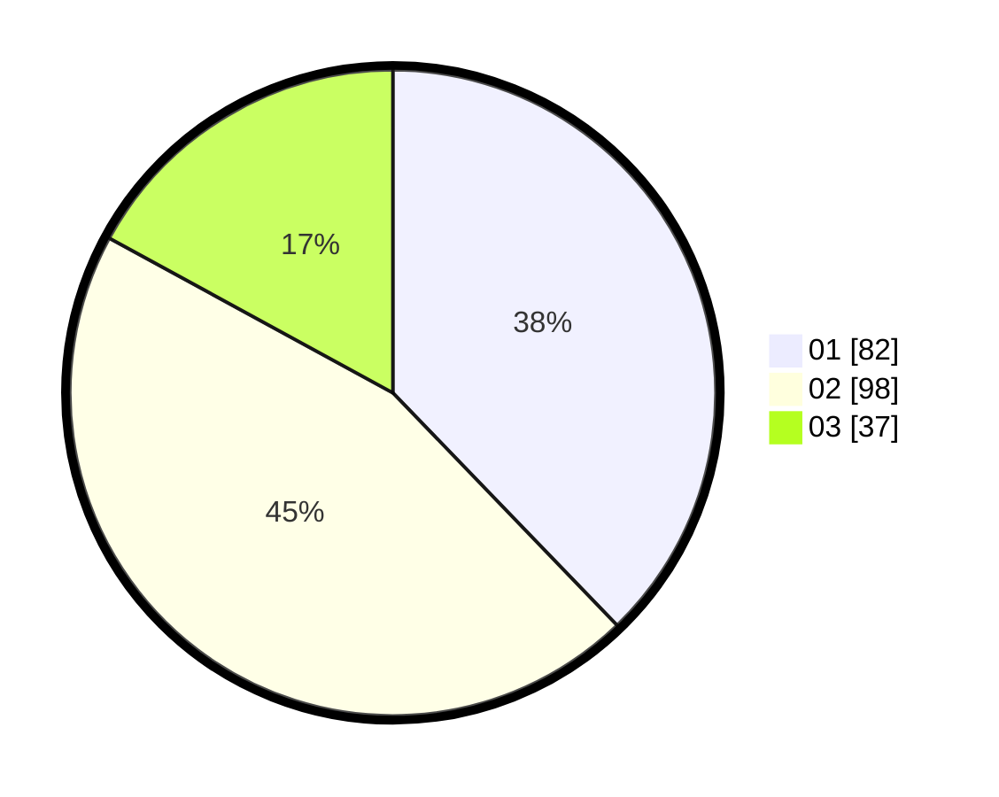

# Hasil

Hasil perolehan suara paslon dapat dilihat pada file paslon-01.txt, paslon-02.txt, dan paslon-03.txt.

Jika tidak ada, artinya data tersebut belum ada pada SIREKAP.

## Perolehan Suara

 * Paslon 01: **82**.
 * Paslon 02: **98**.
 * Paslon 03: **37**.

## Foto C Plano

https://sirekap-obj-formc.kpu.go.id/eb0c/pemilu/ppwp/31/75/08/10/05/3175081005022-20240216-144949--dce321a8-4665-4cf0-b580-3e09e2aec7bf.jpg

https://sirekap-obj-formc.kpu.go.id/eb0c/pemilu/ppwp/31/75/08/10/05/3175081005022-20240216-144951--8eeb5365-57f5-4e8a-83b0-218ab67f2dde.jpg

https://sirekap-obj-formc.kpu.go.id/eb0c/pemilu/ppwp/31/75/08/10/05/3175081005022-20240216-144950--d9b820cf-53ff-41e1-80b9-07bc772e350d.jpg

## DATA PEMILIH TETAP

Jumlah pemilih dalam DPT: **264**.
 * L: **130**.
 * P: **134**.

## DATA PENGGUNA HAK PILIH

Jumlah pengguna hak pilih dalam DPT: **219**.
 * L: **105**.
 * P: **114**.

Jumlah pengguna hak pilih dalam DPTb: **1**.
 * L: **0**.
 * P: **1**.

Jumlah pengguna hak pilih dalam DPK: **0**.
 * L: **0**.
 * P: **0**.

Jumlah pengguna hak pilih: **220**.
 * L: **105**.
 * P: **115**.

## JUMLAH SUARA SAH DAN TIDAK SAH

JUMLAH SELURUH SUARA SAH: **217**.

JUMLAH SUARA TIDAK SAH: **3**.

JUMLAH SELURUH SUARA SAH DAN SUARA TIDAK SAH: **220**.
