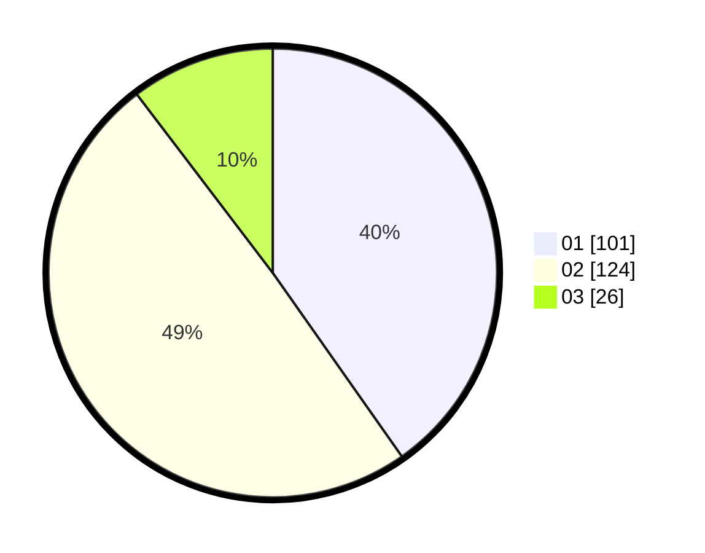

# Hasil

Hasil perolehan suara paslon dapat dilihat pada file paslon-01.txt, paslon-02.txt, dan paslon-03.txt.

Jika tidak ada, artinya data tersebut belum ada pada SIREKAP.

## Perolehan Suara

 * Paslon 01: **101**.
 * Paslon 02: **124**.
 * Paslon 03: **26**.

## Foto C Plano

https://sirekap-obj-formc.kpu.go.id/989b/pemilu/ppwp/31/75/08/10/05/3175081005023-20240214-155521--a73df54f-2643-4d6d-9c18-97f49d9ce3b9.jpg

https://sirekap-obj-formc.kpu.go.id/989b/pemilu/ppwp/31/75/08/10/05/3175081005023-20240216-185229--21714250-c5a3-4d29-86f6-1b3c29172958.jpg

https://sirekap-obj-formc.kpu.go.id/989b/pemilu/ppwp/31/75/08/10/05/3175081005023-20240214-222651--5cbd08ec-4325-4073-8f80-929335d3d79f.jpg

## DATA PEMILIH TETAP

Jumlah pemilih dalam DPT: **289**.
 * L: **146**.
 * P: **143**.

## DATA PENGGUNA HAK PILIH

Jumlah pengguna hak pilih dalam DPT: **251**.
 * L: **120**.
 * P: **131**.

Jumlah pengguna hak pilih dalam DPTb: **0**.
 * L: **0**.
 * P: **0**.

Jumlah pengguna hak pilih dalam DPK: **2**.
 * L: **1**.
 * P: **1**.

Jumlah pengguna hak pilih: **253**.
 * L: **121**.
 * P: **132**.

## JUMLAH SUARA SAH DAN TIDAK SAH

JUMLAH SELURUH SUARA SAH: **251**.

JUMLAH SUARA TIDAK SAH: **2**.

JUMLAH SELURUH SUARA SAH DAN SUARA TIDAK SAH: **253**.
