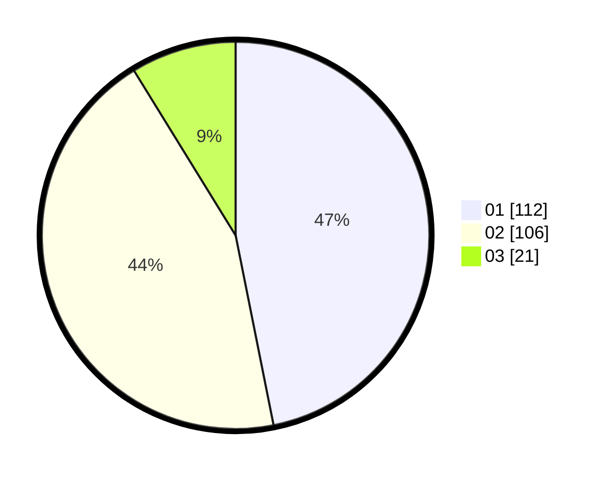

# Hasil

Hasil perolehan suara paslon dapat dilihat pada file paslon-01.txt, paslon-02.txt, dan paslon-03.txt.

Jika tidak ada, artinya data tersebut belum ada pada SIREKAP.

## Perolehan Suara

 * Paslon 01: **112**.
 * Paslon 02: **106**.
 * Paslon 03: **21**.

## Foto C Plano

https://sirekap-obj-formc.kpu.go.id/7369/pemilu/ppwp/31/75/08/10/05/3175081005024-20240215-211034--199b963f-667e-4af0-b191-e410248eccfa.jpg

https://sirekap-obj-formc.kpu.go.id/7369/pemilu/ppwp/31/75/08/10/05/3175081005024-20240215-211035--28003ab4-2045-4108-a843-f4974f5ee7e0.jpg

https://sirekap-obj-formc.kpu.go.id/7369/pemilu/ppwp/31/75/08/10/05/3175081005024-20240215-211034--0491fa5e-6810-467d-a6c9-78b548856899.jpg

## DATA PEMILIH TETAP

Jumlah pemilih dalam DPT: **286**.
 * L: **138**.
 * P: **148**.

## DATA PENGGUNA HAK PILIH

Jumlah pengguna hak pilih dalam DPT: **241**.
 * L: **116**.
 * P: **125**.

Jumlah pengguna hak pilih dalam DPTb: **2**.
 * L: **1**.
 * P: **1**.

Jumlah pengguna hak pilih dalam DPK: **3**.
 * L: **2**.
 * P: **1**.

Jumlah pengguna hak pilih: **246**.
 * L: **119**.
 * P: **127**.

## JUMLAH SUARA SAH DAN TIDAK SAH

JUMLAH SELURUH SUARA SAH: **239**.

JUMLAH SUARA TIDAK SAH: **7**.

JUMLAH SELURUH SUARA SAH DAN SUARA TIDAK SAH: **246**.
