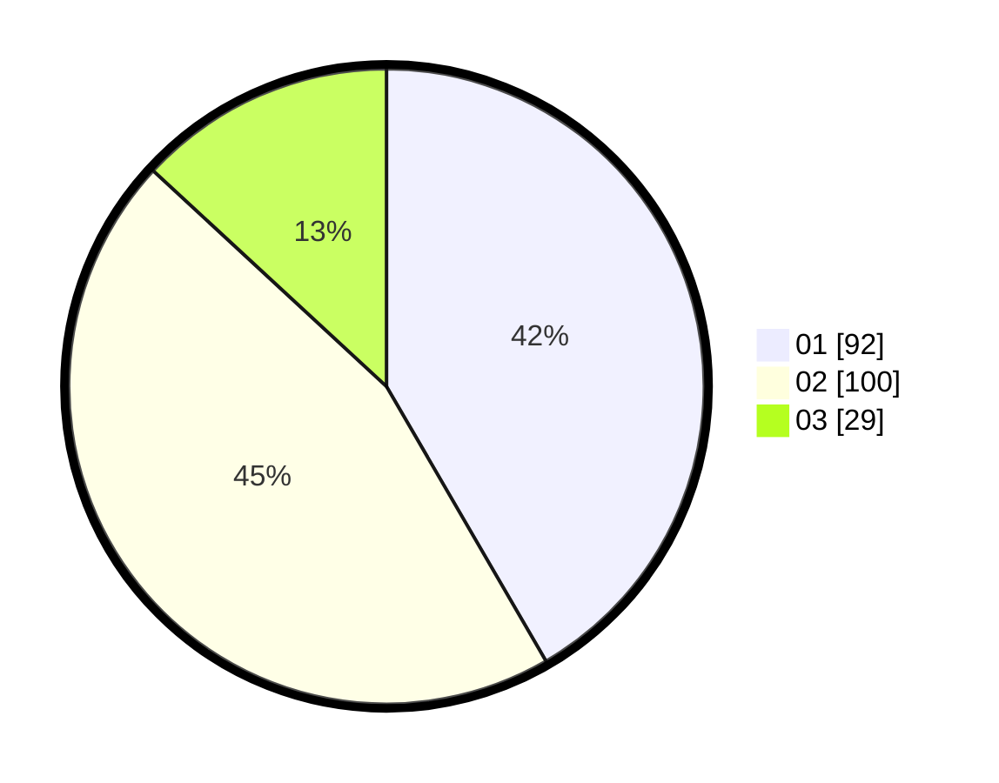

# Hasil

Hasil perolehan suara paslon dapat dilihat pada file paslon-01.txt, paslon-02.txt, dan paslon-03.txt.

Jika tidak ada, artinya data tersebut belum ada pada SIREKAP.

## Perolehan Suara

 * Paslon 01: **92**.
 * Paslon 02: **100**.
 * Paslon 03: **29**.

## Foto C Plano

https://sirekap-obj-formc.kpu.go.id/2016/pemilu/ppwp/31/75/08/10/05/3175081005027-20240214-222346--f64ef708-3e66-4911-84d9-6e81b0a3eee1.jpg

https://sirekap-obj-formc.kpu.go.id/2016/pemilu/ppwp/31/75/08/10/05/3175081005027-20240214-222349--67efde7b-664e-4da8-8fcc-c5381582c4f1.jpg

https://sirekap-obj-formc.kpu.go.id/2016/pemilu/ppwp/31/75/08/10/05/3175081005027-20240214-222351--6b1c3651-7801-4880-99c2-01d2dcdfa8a8.jpg
