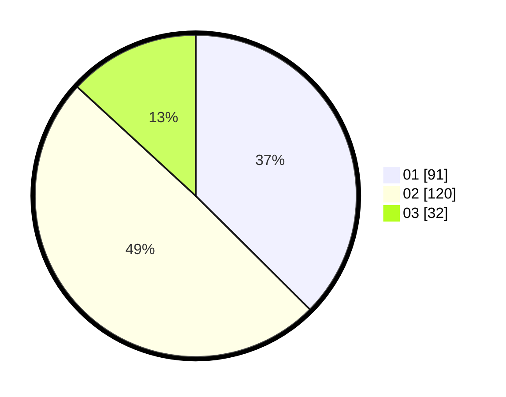

# Hasil

Hasil perolehan suara paslon dapat dilihat pada file paslon-01.txt, paslon-02.txt, dan paslon-03.txt.

Jika tidak ada, artinya data tersebut belum ada pada SIREKAP.

## Perolehan Suara

 * Paslon 01: **91**.
 * Paslon 02: **120**.
 * Paslon 03: **32**.

## Foto C Plano

https://sirekap-obj-formc.kpu.go.id/6ae5/pemilu/ppwp/31/75/08/10/05/3175081005028-20240216-120402--2dad1a8a-007c-4938-a9b5-52ac022cf232.jpg

https://sirekap-obj-formc.kpu.go.id/6ae5/pemilu/ppwp/31/75/08/10/05/3175081005028-20240216-121308--a3450ef1-2ee6-4701-a629-d021c3d2d58c.jpg

https://sirekap-obj-formc.kpu.go.id/6ae5/pemilu/ppwp/31/75/08/10/05/3175081005028-20240216-121641--1371eed6-1708-4695-9eed-e445cb36ed44.jpg
