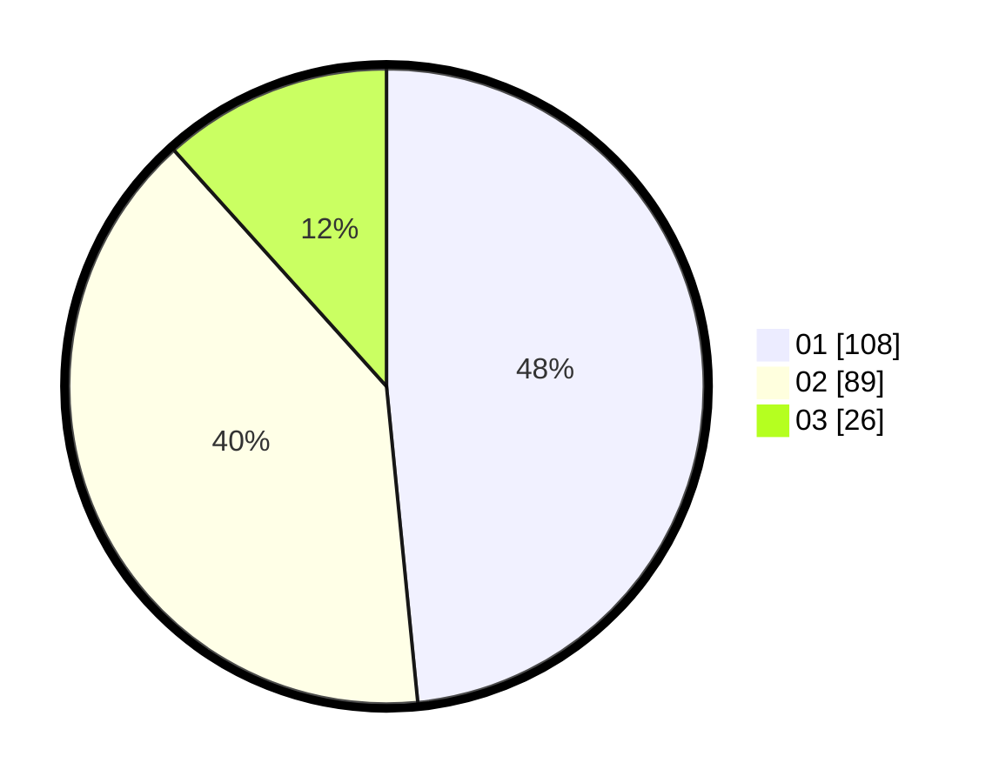

# Hasil

Hasil perolehan suara paslon dapat dilihat pada file paslon-01.txt, paslon-02.txt, dan paslon-03.txt.

Jika tidak ada, artinya data tersebut belum ada pada SIREKAP.

## Perolehan Suara

 * Paslon 01: **108**.
 * Paslon 02: **89**.
 * Paslon 03: **26**.

## Foto C Plano

https://sirekap-obj-formc.kpu.go.id/2618/pemilu/ppwp/31/75/08/10/05/3175081005032-20240215-010158--df82e2d8-72d3-45d1-81ba-0e85239395a1.jpg

https://sirekap-obj-formc.kpu.go.id/2618/pemilu/ppwp/31/75/08/10/05/3175081005032-20240215-010208--af874942-78b7-41be-b8f2-0d442e7c7f50.jpg

https://sirekap-obj-formc.kpu.go.id/2618/pemilu/ppwp/31/75/08/10/05/3175081005032-20240215-010214--4b5be45c-5018-4cbc-9b60-72d5082f35fe.jpg
