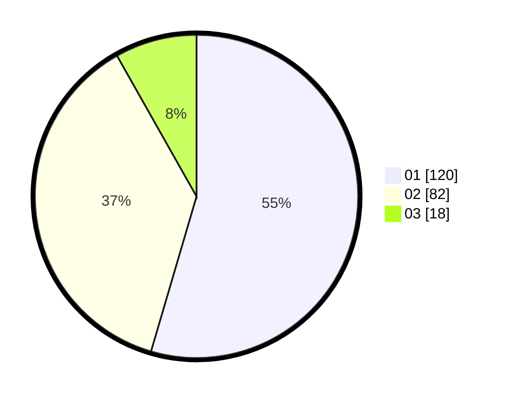

# Hasil

Hasil perolehan suara paslon dapat dilihat pada file paslon-01.txt, paslon-02.txt, dan paslon-03.txt.

Jika tidak ada, artinya data tersebut belum ada pada SIREKAP.

## Perolehan Suara

 * Paslon 01: **120**.
 * Paslon 02: **82**.
 * Paslon 03: **18**.

## Foto C Plano

https://sirekap-obj-formc.kpu.go.id/b174/pemilu/ppwp/31/75/08/10/05/3175081005033-20240215-001334--9ed6a42a-bc8a-4afe-a9f3-eea63d3dc836.jpg

https://sirekap-obj-formc.kpu.go.id/b174/pemilu/ppwp/31/75/08/10/05/3175081005033-20240215-001534--5e483131-4c84-4946-9eb6-2c97b742ed8c.jpg
