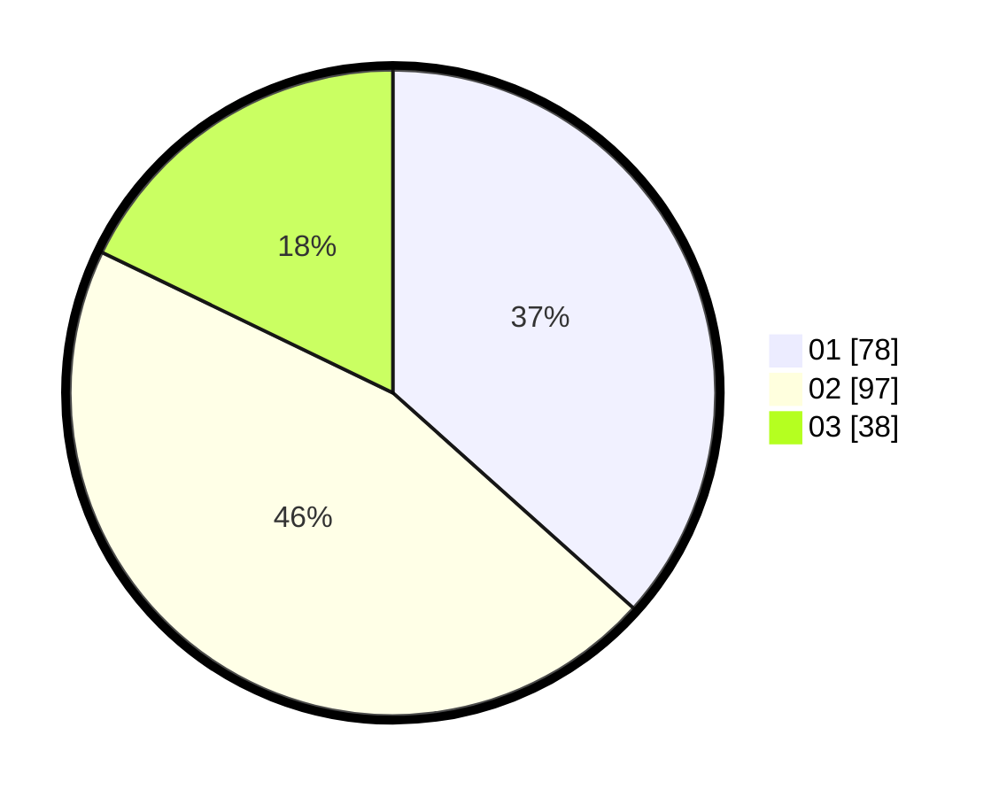

# Hasil

Hasil perolehan suara paslon dapat dilihat pada file paslon-01.txt, paslon-02.txt, dan paslon-03.txt.

Jika tidak ada, artinya data tersebut belum ada pada SIREKAP.

## Perolehan Suara

 * Paslon 01: **78**.
 * Paslon 02: **97**.
 * Paslon 03: **38**.

## Foto C Plano

https://sirekap-obj-formc.kpu.go.id/e09c/pemilu/ppwp/31/75/08/10/05/3175081005034-20240216-065215--700f243b-2704-40b4-aa1d-944730e8739a.jpg

https://sirekap-obj-formc.kpu.go.id/e09c/pemilu/ppwp/31/75/08/10/05/3175081005034-20240216-125841--c712adf0-5e40-4d11-9d38-76a47ff1d8fd.jpg

https://sirekap-obj-formc.kpu.go.id/e09c/pemilu/ppwp/31/75/08/10/05/3175081005034-20240216-125840--d2b7f5f6-db89-47db-80a1-d560456e06d3.jpg

## DATA PEMILIH TETAP

Jumlah pemilih dalam DPT: **256**.
 * L: **138**.
 * P: **118**.

## DATA PENGGUNA HAK PILIH

Jumlah pengguna hak pilih dalam DPT: **207**.
 * L: **110**.
 * P: **97**.

Jumlah pengguna hak pilih dalam DPTb: **1**.
 * L: **1**.
 * P: **0**.

Jumlah pengguna hak pilih dalam DPK: **7**.
 * L: **5**.
 * P: **2**.

Jumlah pengguna hak pilih: **215**.
 * L: **116**.
 * P: **99**.

## JUMLAH SUARA SAH DAN TIDAK SAH

JUMLAH SELURUH SUARA SAH: **213**.

JUMLAH SUARA TIDAK SAH: **2**.

JUMLAH SELURUH SUARA SAH DAN SUARA TIDAK SAH: **215**.
