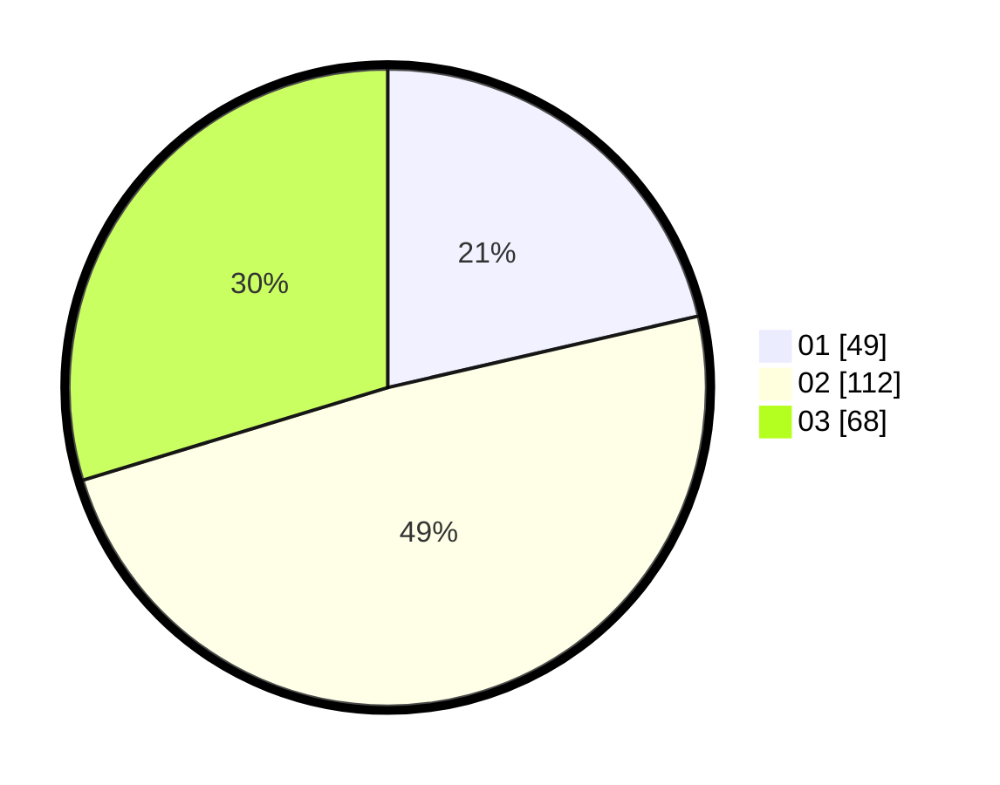

# Hasil

Hasil perolehan suara paslon dapat dilihat pada file paslon-01.txt, paslon-02.txt, dan paslon-03.txt.

Jika tidak ada, artinya data tersebut belum ada pada SIREKAP.

## Perolehan Suara

 * Paslon 01: **49**.
 * Paslon 02: **112**.
 * Paslon 03: **68**.

## Foto C Plano

https://sirekap-obj-formc.kpu.go.id/e654/pemilu/ppwp/31/75/08/10/05/3175081005036-20240215-222233--a9987bdb-7992-49ba-9d58-ae4dca0d0d57.jpg

https://sirekap-obj-formc.kpu.go.id/e654/pemilu/ppwp/31/75/08/10/05/3175081005036-20240215-222234--71bef396-edea-42fe-a80b-e0405e33edd9.jpg

https://sirekap-obj-formc.kpu.go.id/e654/pemilu/ppwp/31/75/08/10/05/3175081005036-20240215-222234--47dbc37a-5c8d-403e-828b-85313b3d7545.jpg

## DATA PEMILIH TETAP

Jumlah pemilih dalam DPT: **0**.
 * L: **0**.
 * P: **0**.

## DATA PENGGUNA HAK PILIH

Jumlah pengguna hak pilih dalam DPT: **0**.
 * L: **0**.
 * P: **0**.

Jumlah pengguna hak pilih dalam DPTb: **0**.
 * L: **0**.
 * P: **0**.

Jumlah pengguna hak pilih dalam DPK: **0**.
 * L: **0**.
 * P: **0**.

Jumlah pengguna hak pilih: **0**.
 * L: **0**.
 * P: **0**.

## JUMLAH SUARA SAH DAN TIDAK SAH

JUMLAH SELURUH SUARA SAH: **229**.

JUMLAH SUARA TIDAK SAH: **5**.

JUMLAH SELURUH SUARA SAH DAN SUARA TIDAK SAH: **234**.
