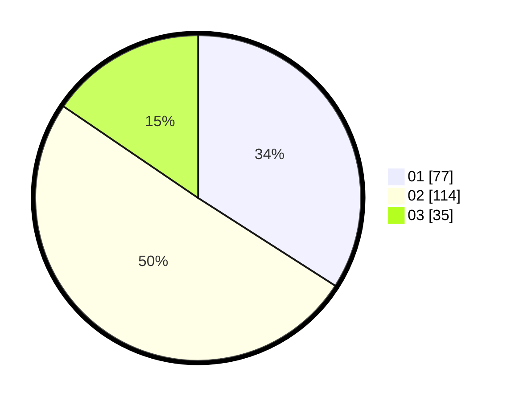

# Hasil

Hasil perolehan suara paslon dapat dilihat pada file paslon-01.txt, paslon-02.txt, dan paslon-03.txt.

Jika tidak ada, artinya data tersebut belum ada pada SIREKAP.

## Perolehan Suara

 * Paslon 01: **77**.
 * Paslon 02: **114**.
 * Paslon 03: **35**.

## Foto C Plano

https://sirekap-obj-formc.kpu.go.id/cf15/pemilu/ppwp/31/75/08/10/05/3175081005039-20240215-000050--1975c97e-dfec-4c06-8c43-51fb845c618b.jpg

https://sirekap-obj-formc.kpu.go.id/cf15/pemilu/ppwp/31/75/08/10/05/3175081005039-20240215-000151--6fc270f6-0b7c-4c64-8e85-e628c379889a.jpg

https://sirekap-obj-formc.kpu.go.id/cf15/pemilu/ppwp/31/75/08/10/05/3175081005039-20240215-000342--be803cf4-d5d9-43c5-b438-c619ad17c928.jpg

## DATA PEMILIH TETAP

Jumlah pemilih dalam DPT: **225**.
 * L: **143**.
 * P: **142**.

## DATA PENGGUNA HAK PILIH

Jumlah pengguna hak pilih dalam DPT: **282**.
 * L: **842**.
 * P: **140**.

Jumlah pengguna hak pilih dalam DPTb: **0**.
 * L: **500**.
 * P: **0**.

Jumlah pengguna hak pilih dalam DPK: **0**.
 * L: **1**.
 * P: **0**.

Jumlah pengguna hak pilih: **282**.
 * L: **142**.
 * P: **140**.

## JUMLAH SUARA SAH DAN TIDAK SAH

JUMLAH SELURUH SUARA SAH: **226**.

JUMLAH SUARA TIDAK SAH: **2**.

JUMLAH SELURUH SUARA SAH DAN SUARA TIDAK SAH: **228**.
