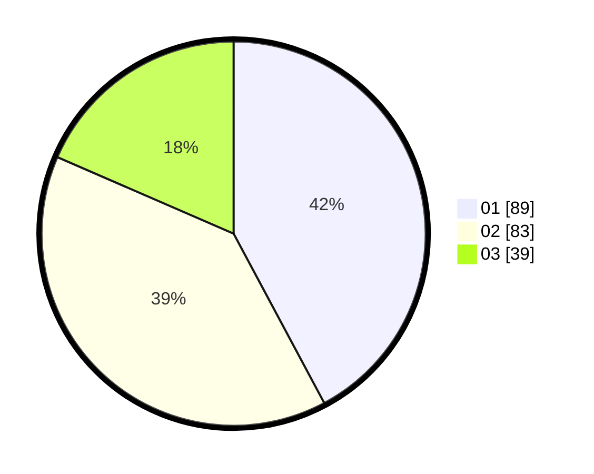

# Hasil

Hasil perolehan suara paslon dapat dilihat pada file paslon-01.txt, paslon-02.txt, dan paslon-03.txt.

Jika tidak ada, artinya data tersebut belum ada pada SIREKAP.

## Perolehan Suara

 * Paslon 01: **89**.
 * Paslon 02: **83**.
 * Paslon 03: **39**.

## Foto C Plano

https://sirekap-obj-formc.kpu.go.id/7cab/pemilu/ppwp/31/75/08/10/05/3175081005040-20240214-212757--57b8a210-9384-4653-afc5-6a3f6360be96.jpg

https://sirekap-obj-formc.kpu.go.id/7cab/pemilu/ppwp/31/75/08/10/05/3175081005040-20240214-212849--a8eeb6c5-b811-40c5-a1c0-e66d782c160c.jpg

https://sirekap-obj-formc.kpu.go.id/7cab/pemilu/ppwp/31/75/08/10/05/3175081005040-20240214-212932--2730a07f-a7e2-48b5-aee2-f02ffc82cd5a.jpg
