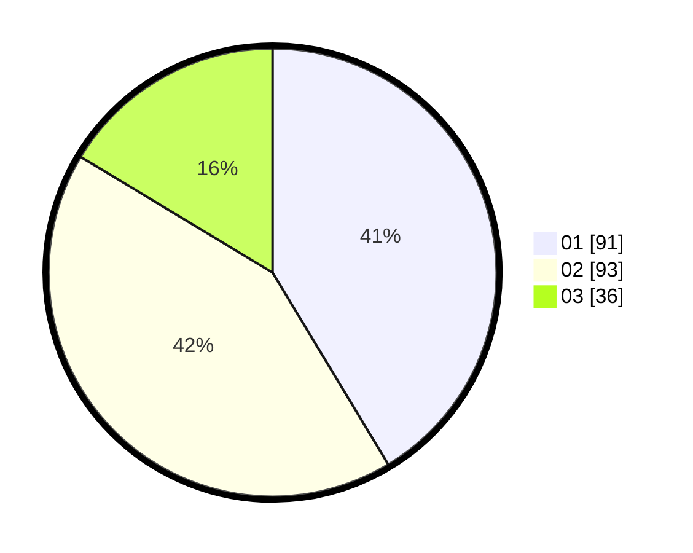

# Hasil

Hasil perolehan suara paslon dapat dilihat pada file paslon-01.txt, paslon-02.txt, dan paslon-03.txt.

Jika tidak ada, artinya data tersebut belum ada pada SIREKAP.

## Perolehan Suara

 * Paslon 01: **91**.
 * Paslon 02: **93**.
 * Paslon 03: **36**.

## Foto C Plano

https://sirekap-obj-formc.kpu.go.id/a184/pemilu/ppwp/31/75/08/10/05/3175081005045-20240215-223324--d1bfded4-f731-4671-95a0-f2b3ede0a137.jpg

https://sirekap-obj-formc.kpu.go.id/a184/pemilu/ppwp/31/75/08/10/05/3175081005045-20240214-155439--a1777e68-c1ca-4bb1-95bf-b2fc1972b28d.jpg

https://sirekap-obj-formc.kpu.go.id/a184/pemilu/ppwp/31/75/08/10/05/3175081005045-20240214-185927--0dd144c1-a2c9-4d8f-91e0-601d0facadc1.jpg

## DATA PEMILIH TETAP

Jumlah pemilih dalam DPT: **264**.
 * L: **137**.
 * P: **127**.

## DATA PENGGUNA HAK PILIH

Jumlah pengguna hak pilih dalam DPT: **219**.
 * L: **112**.
 * P: **107**.

Jumlah pengguna hak pilih dalam DPTb: **0**.
 * L: **0**.
 * P: **0**.

Jumlah pengguna hak pilih dalam DPK: **3**.
 * L: **1**.
 * P: **2**.

Jumlah pengguna hak pilih: **222**.
 * L: **113**.
 * P: **109**.

## JUMLAH SUARA SAH DAN TIDAK SAH

JUMLAH SELURUH SUARA SAH: **220**.

JUMLAH SUARA TIDAK SAH: **2**.

JUMLAH SELURUH SUARA SAH DAN SUARA TIDAK SAH: **222**.
