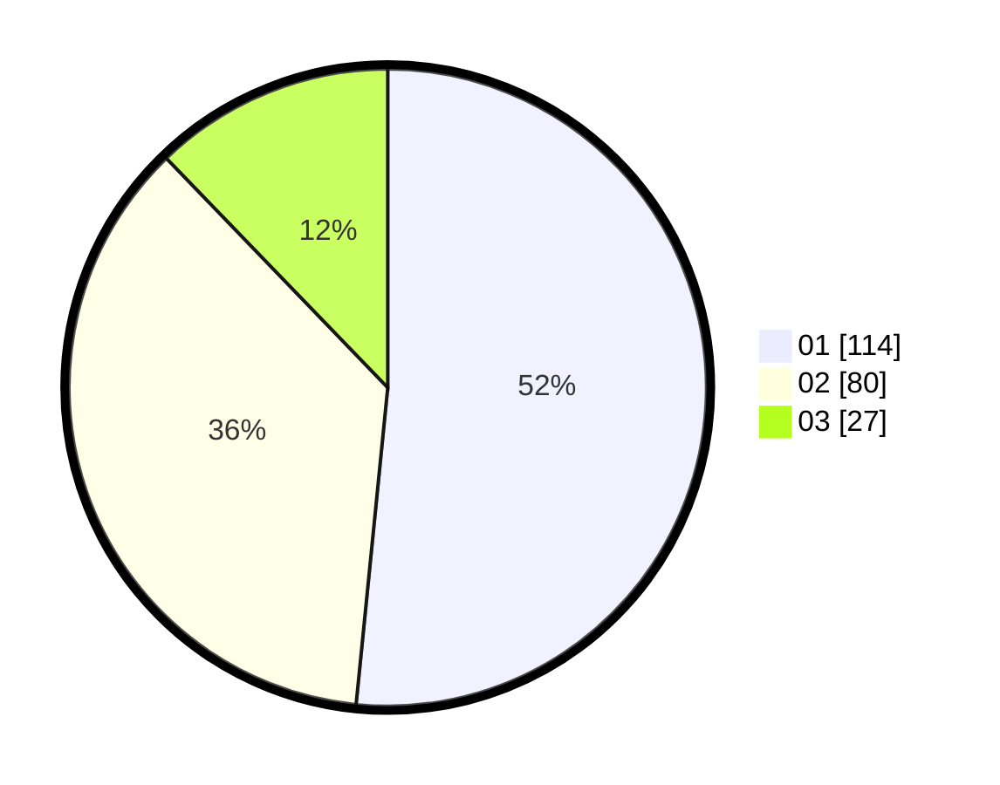

# Hasil

Hasil perolehan suara paslon dapat dilihat pada file paslon-01.txt, paslon-02.txt, dan paslon-03.txt.

Jika tidak ada, artinya data tersebut belum ada pada SIREKAP.

## Perolehan Suara

 * Paslon 01: **114**.
 * Paslon 02: **80**.
 * Paslon 03: **27**.

## Foto C Plano

https://sirekap-obj-formc.kpu.go.id/f35c/pemilu/ppwp/31/75/08/10/05/3175081005046-20240215-003414--de7d884d-c584-4b4a-84a2-b0bd2f76a061.jpg

https://sirekap-obj-formc.kpu.go.id/f35c/pemilu/ppwp/31/75/08/10/05/3175081005046-20240215-003118--80943e09-9e5d-4ee1-8846-26d418ac920a.jpg

https://sirekap-obj-formc.kpu.go.id/f35c/pemilu/ppwp/31/75/08/10/05/3175081005046-20240215-003205--194d5b97-d968-46bd-a64f-9e2377453782.jpg

## DATA PEMILIH TETAP

Jumlah pemilih dalam DPT: **280**.
 * L: **139**.
 * P: **141**.

## DATA PENGGUNA HAK PILIH

Jumlah pengguna hak pilih dalam DPT: **224**.
 * L: **108**.
 * P: **116**.

Jumlah pengguna hak pilih dalam DPTb: **3**.
 * L: **2**.
 * P: **1**.

Jumlah pengguna hak pilih dalam DPK: **1**.
 * L: **1**.
 * P: **0**.

Jumlah pengguna hak pilih: **228**.
 * L: **111**.
 * P: **117**.

## JUMLAH SUARA SAH DAN TIDAK SAH

JUMLAH SELURUH SUARA SAH: **221**.

JUMLAH SUARA TIDAK SAH: **7**.

JUMLAH SELURUH SUARA SAH DAN SUARA TIDAK SAH: **228**.
