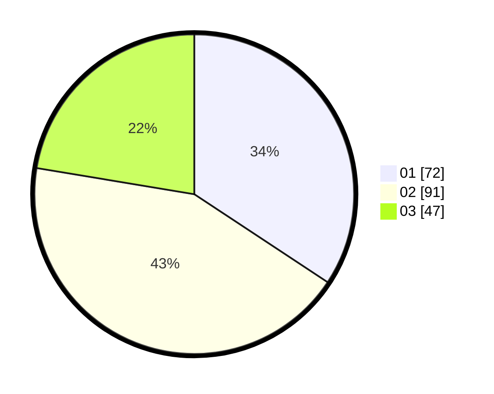

# Hasil

Hasil perolehan suara paslon dapat dilihat pada file paslon-01.txt, paslon-02.txt, dan paslon-03.txt.

Jika tidak ada, artinya data tersebut belum ada pada SIREKAP.

## Perolehan Suara

 * Paslon 01: **72**.
 * Paslon 02: **91**.
 * Paslon 03: **47**.

## Foto C Plano

https://sirekap-obj-formc.kpu.go.id/4923/pemilu/ppwp/31/75/08/10/05/3175081005055-20240216-010446--a46cb138-5fae-4e8b-adb4-c3ac1af4a82b.jpg

https://sirekap-obj-formc.kpu.go.id/4923/pemilu/ppwp/31/75/08/10/05/3175081005055-20240216-010453--0ee362a4-3994-464a-9130-16ccffaa72c3.jpg

https://sirekap-obj-formc.kpu.go.id/4923/pemilu/ppwp/31/75/08/10/05/3175081005055-20240216-010449--bf2c896e-09cc-41b6-a1a0-5ab14e20caf4.jpg

## DATA PEMILIH TETAP

Jumlah pemilih dalam DPT: **277**.
 * L: **136**.
 * P: **141**.

## DATA PENGGUNA HAK PILIH

Jumlah pengguna hak pilih dalam DPT: **213**.
 * L: **96**.
 * P: **117**.

Jumlah pengguna hak pilih dalam DPTb: **1**.
 * L: **0**.
 * P: **1**.

Jumlah pengguna hak pilih dalam DPK: **0**.
 * L: **0**.
 * P: **0**.

Jumlah pengguna hak pilih: **214**.
 * L: **96**.
 * P: **118**.

## JUMLAH SUARA SAH DAN TIDAK SAH

JUMLAH SELURUH SUARA SAH: **210**.

JUMLAH SUARA TIDAK SAH: **4**.

JUMLAH SELURUH SUARA SAH DAN SUARA TIDAK SAH: **214**.
