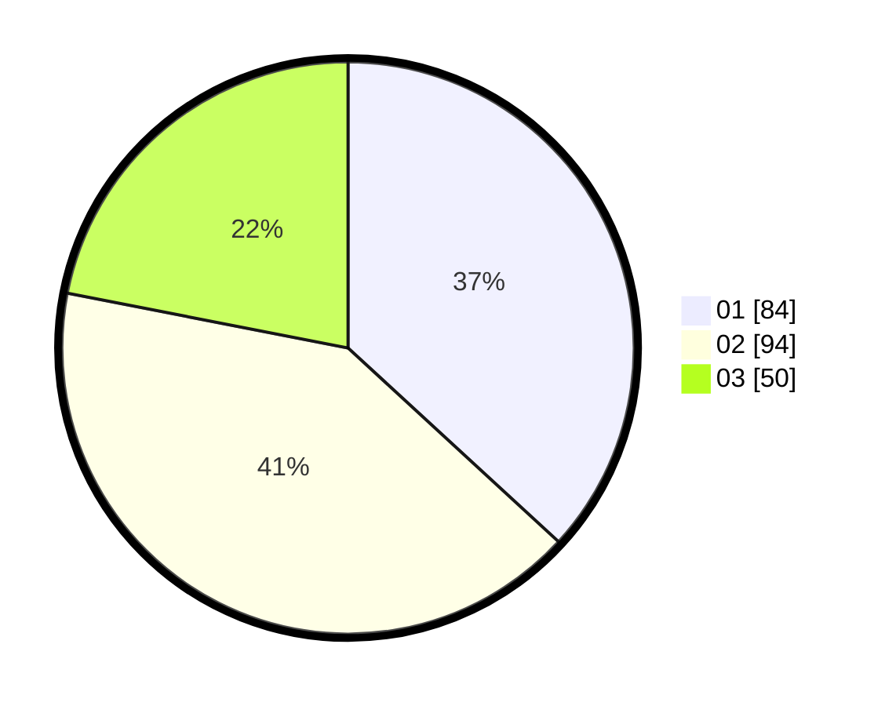

# Hasil

Hasil perolehan suara paslon dapat dilihat pada file paslon-01.txt, paslon-02.txt, dan paslon-03.txt.

Jika tidak ada, artinya data tersebut belum ada pada SIREKAP.

## Perolehan Suara

 * Paslon 01: **84**.
 * Paslon 02: **94**.
 * Paslon 03: **50**.

## Foto C Plano

https://sirekap-obj-formc.kpu.go.id/8c45/pemilu/ppwp/31/75/08/10/05/3175081005056-20240216-120800--35dcffbf-9bd2-4440-879e-4e62150a28d2.jpg

https://sirekap-obj-formc.kpu.go.id/8c45/pemilu/ppwp/31/75/08/10/05/3175081005056-20240216-120804--16d6becc-209f-4766-b689-3d5484b45797.jpg

https://sirekap-obj-formc.kpu.go.id/8c45/pemilu/ppwp/31/75/08/10/05/3175081005056-20240216-120802--e0054301-1232-48a0-82e3-ad44b380793b.jpg

## DATA PEMILIH TETAP

Jumlah pemilih dalam DPT: **280**.
 * L: **144**.
 * P: **136**.

## DATA PENGGUNA HAK PILIH

Jumlah pengguna hak pilih dalam DPT: **228**.
 * L: **113**.
 * P: **115**.

Jumlah pengguna hak pilih dalam DPTb: **2**.
 * L: **0**.
 * P: **2**.

Jumlah pengguna hak pilih dalam DPK: **1**.
 * L: **0**.
 * P: **1**.

Jumlah pengguna hak pilih: **231**.
 * L: **113**.
 * P: **118**.

## JUMLAH SUARA SAH DAN TIDAK SAH

JUMLAH SELURUH SUARA SAH: **228**.

JUMLAH SUARA TIDAK SAH: **3**.

JUMLAH SELURUH SUARA SAH DAN SUARA TIDAK SAH: **231**.
