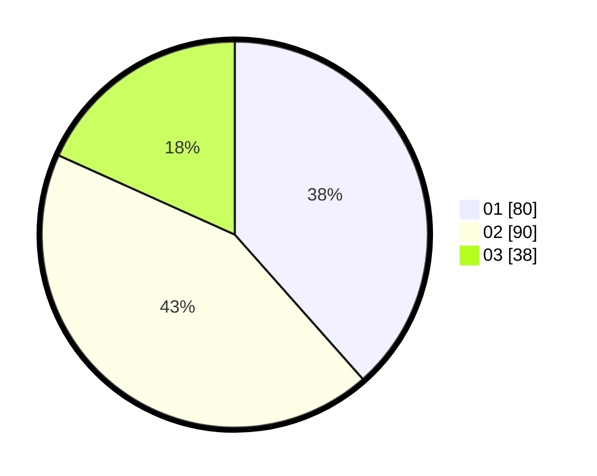

# Hasil

Hasil perolehan suara paslon dapat dilihat pada file paslon-01.txt, paslon-02.txt, dan paslon-03.txt.

Jika tidak ada, artinya data tersebut belum ada pada SIREKAP.

## Perolehan Suara

 * Paslon 01: **80**.
 * Paslon 02: **90**.
 * Paslon 03: **38**.

## Foto C Plano

https://sirekap-obj-formc.kpu.go.id/cb75/pemilu/ppwp/31/75/08/10/05/3175081005057-20240214-184806--27892929-0b47-4220-888a-2c5cc7cbbfb1.jpg

https://sirekap-obj-formc.kpu.go.id/cb75/pemilu/ppwp/31/75/08/10/05/3175081005057-20240214-184651--9df97a2d-9819-4436-b93c-c4d9ca6fffbc.jpg

https://sirekap-obj-formc.kpu.go.id/cb75/pemilu/ppwp/31/75/08/10/05/3175081005057-20240214-184724--38c8ae14-e716-4c0a-833d-a97a0b4aa404.jpg
