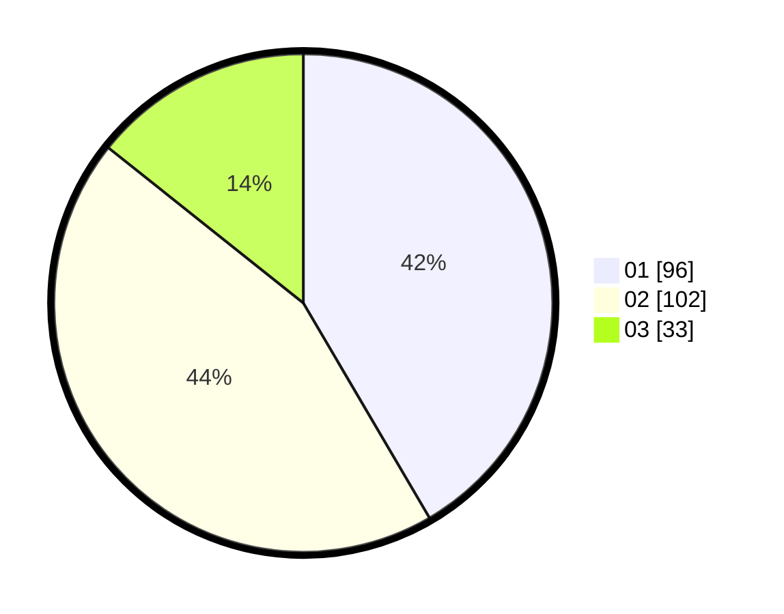

# Hasil

Hasil perolehan suara paslon dapat dilihat pada file paslon-01.txt, paslon-02.txt, dan paslon-03.txt.

Jika tidak ada, artinya data tersebut belum ada pada SIREKAP.

## Perolehan Suara

 * Paslon 01: **96**.
 * Paslon 02: **102**.
 * Paslon 03: **33**.

## Foto C Plano

https://sirekap-obj-formc.kpu.go.id/9ce4/pemilu/ppwp/31/75/08/10/05/3175081005064-20240214-193849--ca997466-a7ba-4327-83b9-dac859127549.jpg

https://sirekap-obj-formc.kpu.go.id/9ce4/pemilu/ppwp/31/75/08/10/05/3175081005064-20240214-213159--d28945cc-9e2a-4d40-b776-9a691c86f58d.jpg

https://sirekap-obj-formc.kpu.go.id/9ce4/pemilu/ppwp/31/75/08/10/05/3175081005064-20240214-194332--d4b90cf3-16ff-49e5-899c-9e44714a4753.jpg

## DATA PEMILIH TETAP

Jumlah pemilih dalam DPT: **275**.
 * L: **137**.
 * P: **138**.

## DATA PENGGUNA HAK PILIH

Jumlah pengguna hak pilih dalam DPT: **235**.
 * L: **119**.
 * P: **116**.

Jumlah pengguna hak pilih dalam DPTb: **1**.
 * L: **1**.
 * P: **0**.

Jumlah pengguna hak pilih dalam DPK: **1**.
 * L: **0**.
 * P: **1**.

Jumlah pengguna hak pilih: **237**.
 * L: **120**.
 * P: **117**.

## JUMLAH SUARA SAH DAN TIDAK SAH

JUMLAH SELURUH SUARA SAH: **231**.

JUMLAH SUARA TIDAK SAH: **6**.

JUMLAH SELURUH SUARA SAH DAN SUARA TIDAK SAH: **237**.
