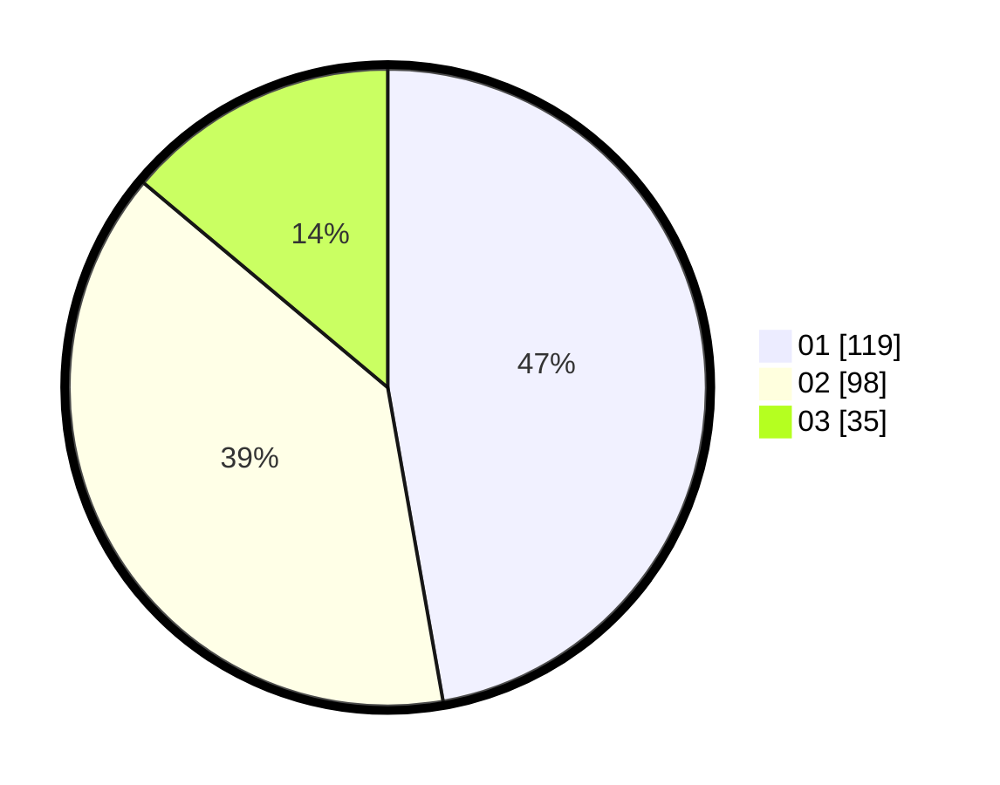

# Hasil

Hasil perolehan suara paslon dapat dilihat pada file paslon-01.txt, paslon-02.txt, dan paslon-03.txt.

Jika tidak ada, artinya data tersebut belum ada pada SIREKAP.

## Perolehan Suara

 * Paslon 01: **119**.
 * Paslon 02: **98**.
 * Paslon 03: **35**.

## Foto C Plano

https://sirekap-obj-formc.kpu.go.id/b3ea/pemilu/ppwp/31/75/08/10/05/3175081005065-20240214-225238--d2abf702-c29d-4431-a1a5-745f07acfb44.jpg

https://sirekap-obj-formc.kpu.go.id/b3ea/pemilu/ppwp/31/75/08/10/05/3175081005065-20240214-225433--a03673db-df28-4ffe-8760-fee65f28c320.jpg

https://sirekap-obj-formc.kpu.go.id/b3ea/pemilu/ppwp/31/75/08/10/05/3175081005065-20240214-225557--1d2f96b1-6e2b-4a85-938a-9355429baecb.jpg
