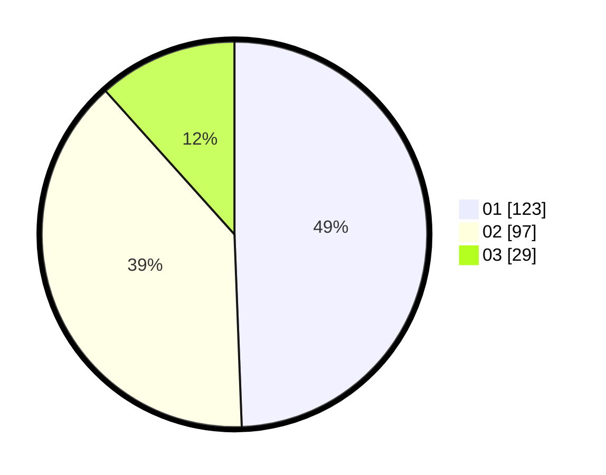

# Hasil

Hasil perolehan suara paslon dapat dilihat pada file paslon-01.txt, paslon-02.txt, dan paslon-03.txt.

Jika tidak ada, artinya data tersebut belum ada pada SIREKAP.

## Perolehan Suara

 * Paslon 01: **123**.
 * Paslon 02: **97**.
 * Paslon 03: **29**.

## Foto C Plano

https://sirekap-obj-formc.kpu.go.id/ebb8/pemilu/ppwp/31/75/08/10/05/3175081005067-20240215-224346--09d4a179-0430-4549-b876-16978b1acaa4.jpg

https://sirekap-obj-formc.kpu.go.id/ebb8/pemilu/ppwp/31/75/08/10/05/3175081005067-20240215-224349--67eec934-8d80-4eda-ba80-8138234dcf79.jpg

https://sirekap-obj-formc.kpu.go.id/ebb8/pemilu/ppwp/31/75/08/10/05/3175081005067-20240215-224347--02d96d20-d5f9-434e-92e7-44de89f6b2f5.jpg

## DATA PEMILIH TETAP

Jumlah pemilih dalam DPT: **286**.
 * L: **146**.
 * P: **140**.

## DATA PENGGUNA HAK PILIH

Jumlah pengguna hak pilih dalam DPT: **248**.
 * L: **124**.
 * P: **124**.

Jumlah pengguna hak pilih dalam DPTb: **1**.
 * L: **0**.
 * P: **1**.

Jumlah pengguna hak pilih dalam DPK: **2**.
 * L: **0**.
 * P: **2**.

Jumlah pengguna hak pilih: **251**.
 * L: **124**.
 * P: **127**.

## JUMLAH SUARA SAH DAN TIDAK SAH

JUMLAH SELURUH SUARA SAH: **249**.

JUMLAH SUARA TIDAK SAH: **2**.

JUMLAH SELURUH SUARA SAH DAN SUARA TIDAK SAH: **251**.
