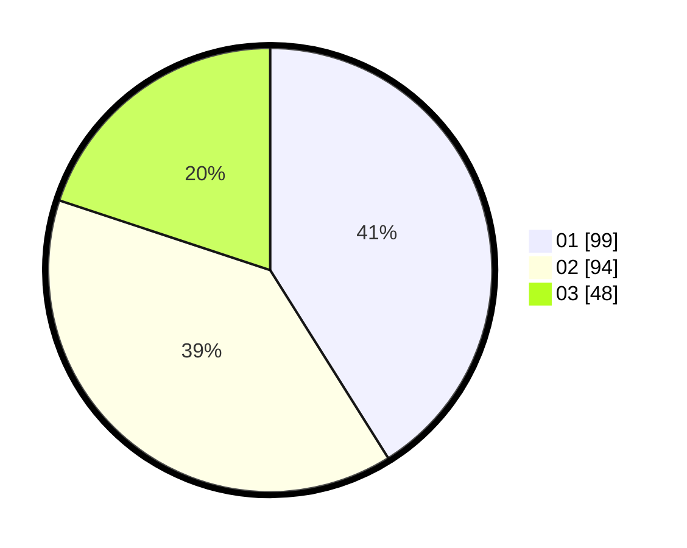

# Hasil

Hasil perolehan suara paslon dapat dilihat pada file paslon-01.txt, paslon-02.txt, dan paslon-03.txt.

Jika tidak ada, artinya data tersebut belum ada pada SIREKAP.

## Perolehan Suara

 * Paslon 01: **99**.
 * Paslon 02: **94**.
 * Paslon 03: **48**.

## Foto C Plano

https://sirekap-obj-formc.kpu.go.id/6475/pemilu/ppwp/31/75/08/10/05/3175081005069-20240214-230559--fc5e9609-f7b9-49d9-877c-265d627cc1d1.jpg

https://sirekap-obj-formc.kpu.go.id/6475/pemilu/ppwp/31/75/08/10/05/3175081005069-20240214-230607--dbb247e4-8060-41d4-9862-630373c36c5b.jpg

https://sirekap-obj-formc.kpu.go.id/6475/pemilu/ppwp/31/75/08/10/05/3175081005069-20240214-230618--902c104c-1906-4739-9d68-1d07e2504481.jpg

## DATA PEMILIH TETAP

Jumlah pemilih dalam DPT: **291**.
 * L: **147**.
 * P: **144**.

## DATA PENGGUNA HAK PILIH

Jumlah pengguna hak pilih dalam DPT: **241**.
 * L: **120**.
 * P: **121**.

Jumlah pengguna hak pilih dalam DPTb: **1**.
 * L: **0**.
 * P: **1**.

Jumlah pengguna hak pilih dalam DPK: **4**.
 * L: **2**.
 * P: **2**.

Jumlah pengguna hak pilih: **246**.
 * L: **122**.
 * P: **124**.

## JUMLAH SUARA SAH DAN TIDAK SAH

JUMLAH SELURUH SUARA SAH: **241**.

JUMLAH SUARA TIDAK SAH: **5**.

JUMLAH SELURUH SUARA SAH DAN SUARA TIDAK SAH: **246**.
