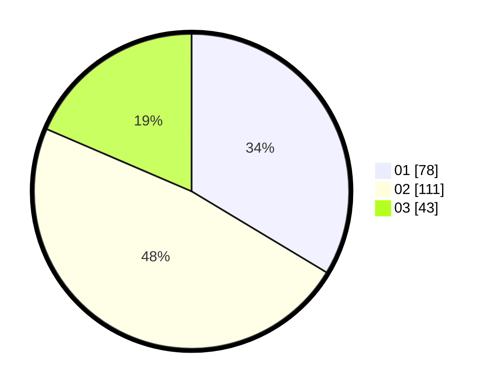

# Hasil

Hasil perolehan suara paslon dapat dilihat pada file paslon-01.txt, paslon-02.txt, dan paslon-03.txt.

Jika tidak ada, artinya data tersebut belum ada pada SIREKAP.

## Perolehan Suara

 * Paslon 01: **78**.
 * Paslon 02: **111**.
 * Paslon 03: **43**.

## Foto C Plano

https://sirekap-obj-formc.kpu.go.id/8e07/pemilu/ppwp/31/75/08/10/05/3175081005073-20240215-023926--64a85cd1-f1f7-49b5-b0ee-abd2a69167d8.jpg

https://sirekap-obj-formc.kpu.go.id/8e07/pemilu/ppwp/31/75/08/10/05/3175081005073-20240214-235653--16f14ba5-dd66-493e-95ae-84b5a83f6682.jpg

https://sirekap-obj-formc.kpu.go.id/8e07/pemilu/ppwp/31/75/08/10/05/3175081005073-20240215-024203--a002a38d-6c11-4059-85ef-f10a46d566d6.jpg
