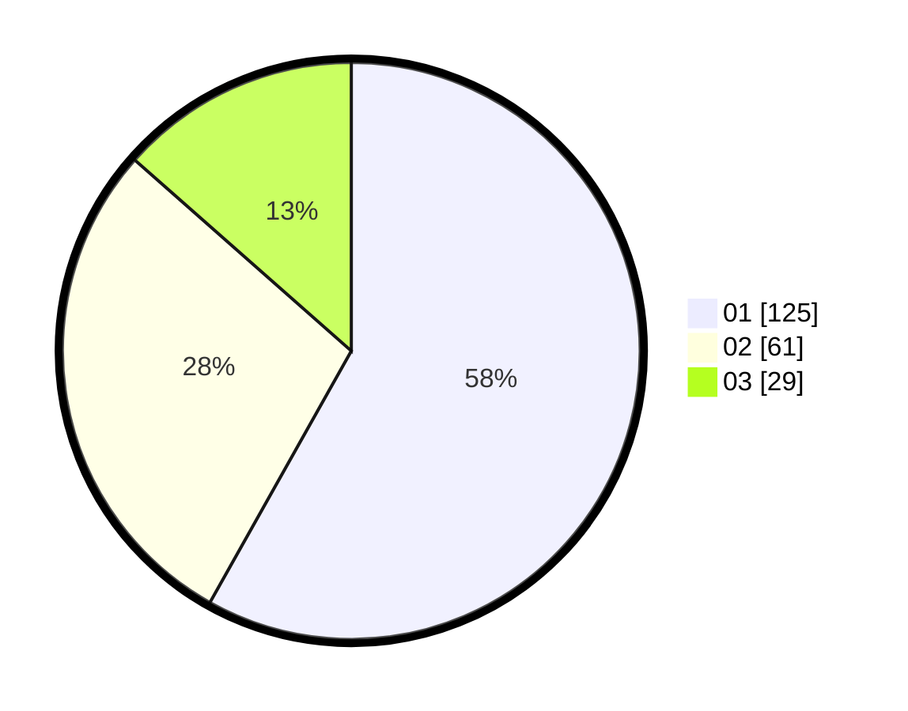

# Hasil

Hasil perolehan suara paslon dapat dilihat pada file paslon-01.txt, paslon-02.txt, dan paslon-03.txt.

Jika tidak ada, artinya data tersebut belum ada pada SIREKAP.

## Perolehan Suara

 * Paslon 01: **125**.
 * Paslon 02: **61**.
 * Paslon 03: **29**.

## Foto C Plano

https://sirekap-obj-formc.kpu.go.id/6302/pemilu/ppwp/31/75/08/10/05/3175081005080-20240216-061739--7308ac0c-5178-465b-888a-e09f7a210d71.jpg

https://sirekap-obj-formc.kpu.go.id/6302/pemilu/ppwp/31/75/08/10/05/3175081005080-20240214-193431--2b241c3e-a88f-4238-87cd-5c95be008d05.jpg

https://sirekap-obj-formc.kpu.go.id/6302/pemilu/ppwp/31/75/08/10/05/3175081005080-20240214-192057--3dba7105-592a-4da3-9998-36ea164e79c9.jpg

## DATA PEMILIH TETAP

Jumlah pemilih dalam DPT: **265**.
 * L: **131**.
 * P: **134**.

## DATA PENGGUNA HAK PILIH

Jumlah pengguna hak pilih dalam DPT: **217**.
 * L: **114**.
 * P: **103**.

Jumlah pengguna hak pilih dalam DPTb: **1**.
 * L: **1**.
 * P: **0**.

Jumlah pengguna hak pilih dalam DPK: **0**.
 * L: **0**.
 * P: **0**.

Jumlah pengguna hak pilih: **218**.
 * L: **115**.
 * P: **103**.

## JUMLAH SUARA SAH DAN TIDAK SAH

JUMLAH SELURUH SUARA SAH: **215**.

JUMLAH SUARA TIDAK SAH: **3**.

JUMLAH SELURUH SUARA SAH DAN SUARA TIDAK SAH: **218**.
