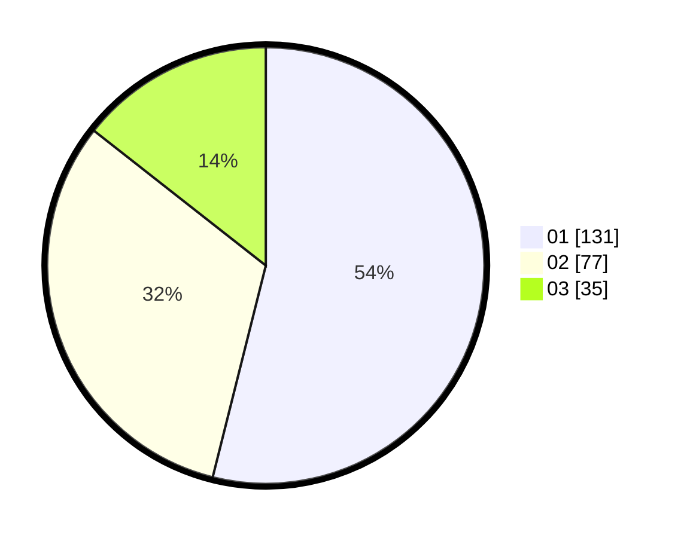

# Hasil

Hasil perolehan suara paslon dapat dilihat pada file paslon-01.txt, paslon-02.txt, dan paslon-03.txt.

Jika tidak ada, artinya data tersebut belum ada pada SIREKAP.

## Perolehan Suara

 * Paslon 01: **131**.
 * Paslon 02: **77**.
 * Paslon 03: **35**.

## Foto C Plano

https://sirekap-obj-formc.kpu.go.id/64df/pemilu/ppwp/31/75/08/10/05/3175081005082-20240214-232649--bf20bc0e-69ae-4de0-86f4-ad41a9a12d85.jpg

https://sirekap-obj-formc.kpu.go.id/64df/pemilu/ppwp/31/75/08/10/05/3175081005082-20240214-232813--824030f8-dd9f-441c-8286-8e218b2fd442.jpg

https://sirekap-obj-formc.kpu.go.id/64df/pemilu/ppwp/31/75/08/10/05/3175081005082-20240214-232847--61973961-f581-4524-a9cc-7515a35c1642.jpg

## DATA PEMILIH TETAP

Jumlah pemilih dalam DPT: **292**.
 * L: **145**.
 * P: **147**.

## DATA PENGGUNA HAK PILIH

Jumlah pengguna hak pilih dalam DPT: **243**.
 * L: **210**.
 * P: **127**.

Jumlah pengguna hak pilih dalam DPTb: **3**.
 * L: **202**.
 * P: **1**.

Jumlah pengguna hak pilih dalam DPK: **0**.
 * L: **0**.
 * P: **0**.

Jumlah pengguna hak pilih: **246**.
 * L: **118**.
 * P: **128**.

## JUMLAH SUARA SAH DAN TIDAK SAH

JUMLAH SELURUH SUARA SAH: **243**.

JUMLAH SUARA TIDAK SAH: **3**.

JUMLAH SELURUH SUARA SAH DAN SUARA TIDAK SAH: **246**.
