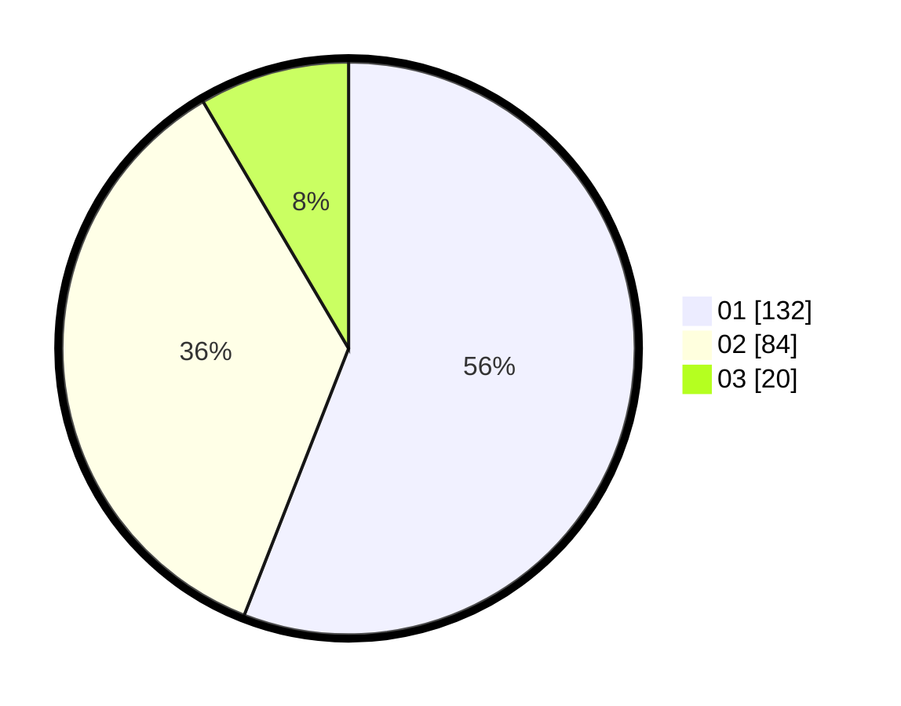

# Hasil

Hasil perolehan suara paslon dapat dilihat pada file paslon-01.txt, paslon-02.txt, dan paslon-03.txt.

Jika tidak ada, artinya data tersebut belum ada pada SIREKAP.

## Perolehan Suara

 * Paslon 01: **132**.
 * Paslon 02: **84**.
 * Paslon 03: **20**.

## Foto C Plano

https://sirekap-obj-formc.kpu.go.id/c1e1/pemilu/ppwp/31/75/08/10/05/3175081005083-20240216-132330--9fe8398c-91c3-402a-8853-5bccf642a0ad.jpg

https://sirekap-obj-formc.kpu.go.id/c1e1/pemilu/ppwp/31/75/08/10/05/3175081005083-20240216-132331--ec031437-8381-4e57-9b05-c131ceabe593.jpg

https://sirekap-obj-formc.kpu.go.id/c1e1/pemilu/ppwp/31/75/08/10/05/3175081005083-20240216-132331--eec302a6-d629-4fc1-a61b-902d9bb9e41f.jpg

## DATA PEMILIH TETAP

Jumlah pemilih dalam DPT: **280**.
 * L: **140**.
 * P: **140**.

## DATA PENGGUNA HAK PILIH

Jumlah pengguna hak pilih dalam DPT: **234**.
 * L: **112**.
 * P: **122**.

Jumlah pengguna hak pilih dalam DPTb: **2**.
 * L: **1**.
 * P: **1**.

Jumlah pengguna hak pilih dalam DPK: **3**.
 * L: **2**.
 * P: **1**.

Jumlah pengguna hak pilih: **239**.
 * L: **115**.
 * P: **124**.

## JUMLAH SUARA SAH DAN TIDAK SAH

JUMLAH SELURUH SUARA SAH: **236**.

JUMLAH SUARA TIDAK SAH: **3**.

JUMLAH SELURUH SUARA SAH DAN SUARA TIDAK SAH: **239**.
