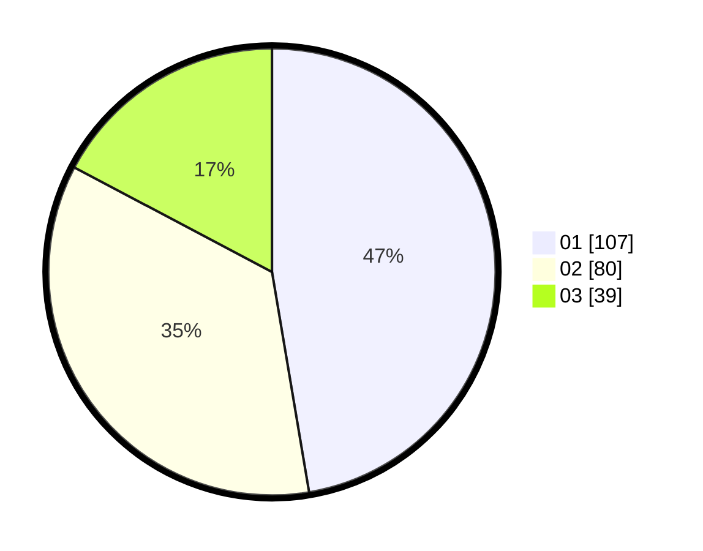

# Hasil

Hasil perolehan suara paslon dapat dilihat pada file paslon-01.txt, paslon-02.txt, dan paslon-03.txt.

Jika tidak ada, artinya data tersebut belum ada pada SIREKAP.

## Perolehan Suara

 * Paslon 01: **107**.
 * Paslon 02: **80**.
 * Paslon 03: **39**.

## Foto C Plano

https://sirekap-obj-formc.kpu.go.id/9549/pemilu/ppwp/31/75/08/10/05/3175081005089-20240216-170951--b0909343-fa2f-48ef-836f-575ad92dfd5d.jpg

https://sirekap-obj-formc.kpu.go.id/9549/pemilu/ppwp/31/75/08/10/05/3175081005089-20240216-170953--0a9ca486-6014-4d28-8514-64fe3bd86b9c.jpg

https://sirekap-obj-formc.kpu.go.id/9549/pemilu/ppwp/31/75/08/10/05/3175081005089-20240216-170952--1518be70-49a6-492b-ae89-f0fea0860c98.jpg

## DATA PEMILIH TETAP

Jumlah pemilih dalam DPT: **281**.
 * L: **144**.
 * P: **137**.

## DATA PENGGUNA HAK PILIH

Jumlah pengguna hak pilih dalam DPT: **219**.
 * L: **100**.
 * P: **119**.

Jumlah pengguna hak pilih dalam DPTb: **4**.
 * L: **2**.
 * P: **2**.

Jumlah pengguna hak pilih dalam DPK: **3**.
 * L: **2**.
 * P: **1**.

Jumlah pengguna hak pilih: **226**.
 * L: **104**.
 * P: **122**.

## JUMLAH SUARA SAH DAN TIDAK SAH

JUMLAH SELURUH SUARA SAH: **226**.

JUMLAH SUARA TIDAK SAH: **0**.

JUMLAH SELURUH SUARA SAH DAN SUARA TIDAK SAH: **226**.
