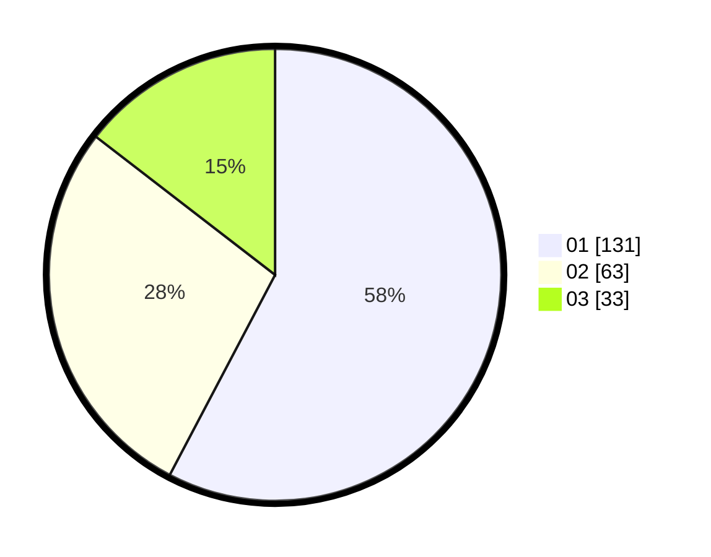

# Hasil

Hasil perolehan suara paslon dapat dilihat pada file paslon-01.txt, paslon-02.txt, dan paslon-03.txt.

Jika tidak ada, artinya data tersebut belum ada pada SIREKAP.

## Perolehan Suara

 * Paslon 01: **131**.
 * Paslon 02: **63**.
 * Paslon 03: **33**.

## Foto C Plano

https://sirekap-obj-formc.kpu.go.id/1e65/pemilu/ppwp/31/75/08/10/05/3175081005091-20240215-030046--fe84dadc-e4cd-42fe-9ce9-286648437447.jpg

https://sirekap-obj-formc.kpu.go.id/1e65/pemilu/ppwp/31/75/08/10/05/3175081005091-20240214-215121--477d1056-557d-47c2-af01-90f45dd78e05.jpg

https://sirekap-obj-formc.kpu.go.id/1e65/pemilu/ppwp/31/75/08/10/05/3175081005091-20240214-215328--6ea33aeb-a34a-47f6-8e7a-5a04bccc1d20.jpg
