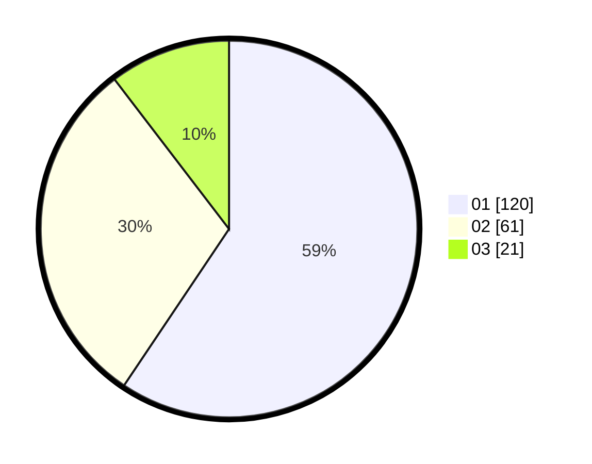

# Hasil

Hasil perolehan suara paslon dapat dilihat pada file paslon-01.txt, paslon-02.txt, dan paslon-03.txt.

Jika tidak ada, artinya data tersebut belum ada pada SIREKAP.

## Perolehan Suara

 * Paslon 01: **120**.
 * Paslon 02: **61**.
 * Paslon 03: **21**.

## Foto C Plano

https://sirekap-obj-formc.kpu.go.id/9b22/pemilu/ppwp/31/75/08/10/05/3175081005092-20240214-235724--2e26f08e-d58c-46d9-a200-2d0c27ce5e11.jpg

https://sirekap-obj-formc.kpu.go.id/9b22/pemilu/ppwp/31/75/08/10/05/3175081005092-20240215-000656--888eb997-06a8-4858-92b8-f1a9f9e81d23.jpg

https://sirekap-obj-formc.kpu.go.id/9b22/pemilu/ppwp/31/75/08/10/05/3175081005092-20240214-235854--6b6f4c21-7e7a-4560-b196-58a23440b976.jpg
