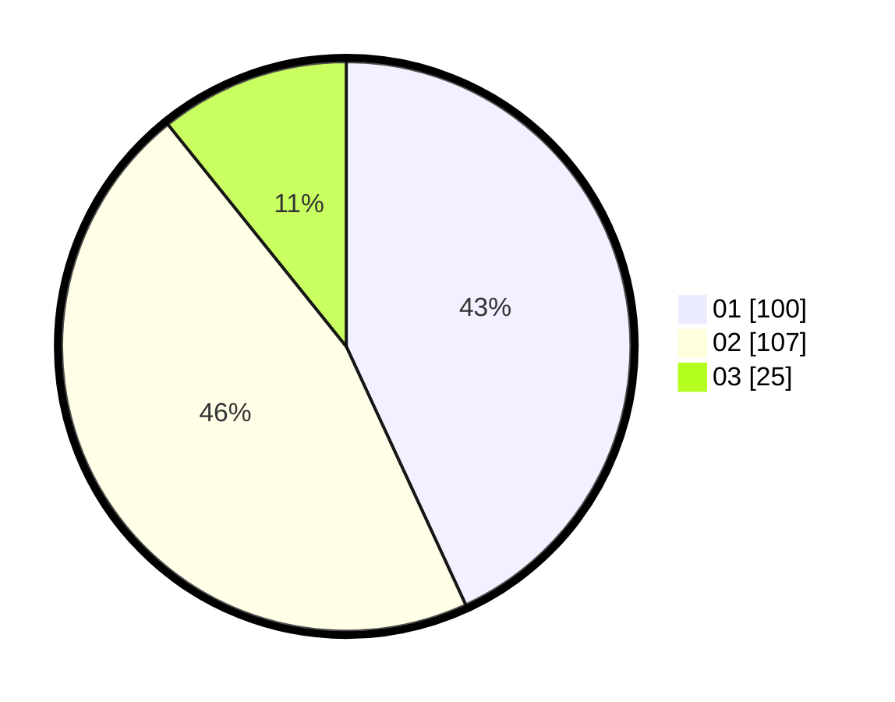

# Hasil

Hasil perolehan suara paslon dapat dilihat pada file paslon-01.txt, paslon-02.txt, dan paslon-03.txt.

Jika tidak ada, artinya data tersebut belum ada pada SIREKAP.

## Perolehan Suara

 * Paslon 01: **100**.
 * Paslon 02: **107**.
 * Paslon 03: **25**.

## Foto C Plano

https://sirekap-obj-formc.kpu.go.id/82c2/pemilu/ppwp/31/75/08/10/05/3175081005094-20240214-221820--9001c88f-66e2-4779-a75b-47b964c2560d.jpg

https://sirekap-obj-formc.kpu.go.id/82c2/pemilu/ppwp/31/75/08/10/05/3175081005094-20240214-221914--5509880a-ddc0-426a-90b1-0dc2b36506d5.jpg

https://sirekap-obj-formc.kpu.go.id/82c2/pemilu/ppwp/31/75/08/10/05/3175081005094-20240214-222318--99c34d51-4bb5-4f83-aa5e-5349c9f45cf2.jpg
