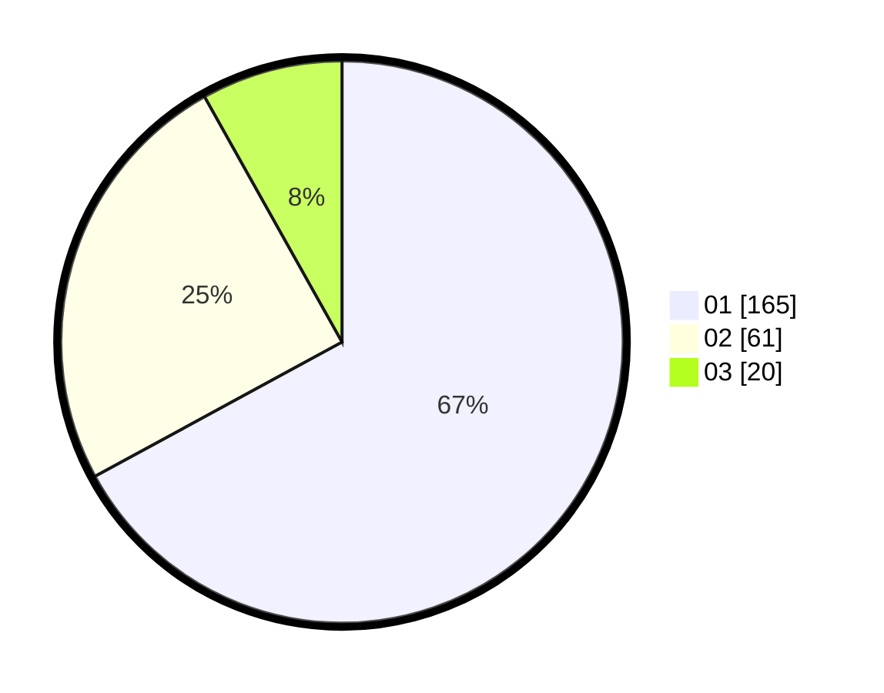

# Hasil

Hasil perolehan suara paslon dapat dilihat pada file paslon-01.txt, paslon-02.txt, dan paslon-03.txt.

Jika tidak ada, artinya data tersebut belum ada pada SIREKAP.

## Perolehan Suara

 * Paslon 01: **165**.
 * Paslon 02: **61**.
 * Paslon 03: **20**.

## Foto C Plano

https://sirekap-obj-formc.kpu.go.id/a90f/pemilu/ppwp/31/75/08/10/05/3175081005096-20240214-193313--1b99c5df-57f8-4301-a269-2c1fcc63b6b3.jpg

https://sirekap-obj-formc.kpu.go.id/a90f/pemilu/ppwp/31/75/08/10/05/3175081005096-20240214-155917--a8b6c9ce-91c8-435a-8b20-e479d0504bf1.jpg

https://sirekap-obj-formc.kpu.go.id/a90f/pemilu/ppwp/31/75/08/10/05/3175081005096-20240214-193322--b1e17987-928d-4f9d-a6e8-476d8b1f0c53.jpg

## DATA PEMILIH TETAP

Jumlah pemilih dalam DPT: **285**.
 * L: **139**.
 * P: **146**.

## DATA PENGGUNA HAK PILIH

Jumlah pengguna hak pilih dalam DPT: **232**.
 * L: **108**.
 * P: **124**.

Jumlah pengguna hak pilih dalam DPTb: **8**.
 * L: **1**.
 * P: **7**.

Jumlah pengguna hak pilih dalam DPK: **9**.
 * L: **6**.
 * P: **3**.

Jumlah pengguna hak pilih: **249**.
 * L: **115**.
 * P: **134**.

## JUMLAH SUARA SAH DAN TIDAK SAH

JUMLAH SELURUH SUARA SAH: **246**.

JUMLAH SUARA TIDAK SAH: **3**.

JUMLAH SELURUH SUARA SAH DAN SUARA TIDAK SAH: **249**.
