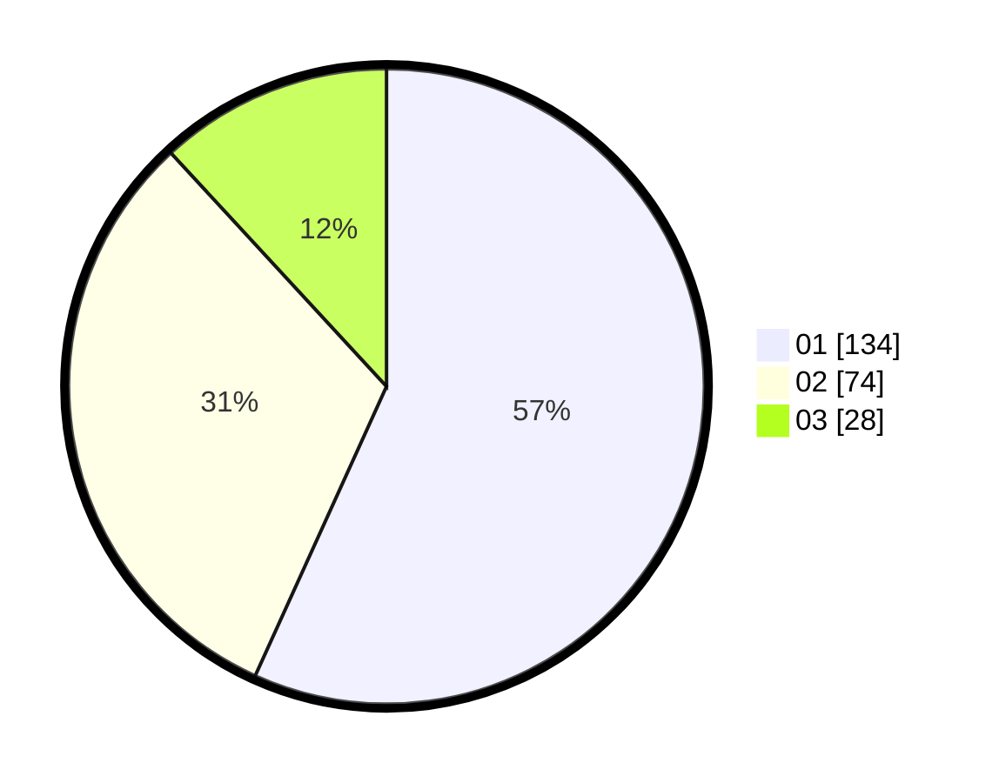

# Hasil

Hasil perolehan suara paslon dapat dilihat pada file paslon-01.txt, paslon-02.txt, dan paslon-03.txt.

Jika tidak ada, artinya data tersebut belum ada pada SIREKAP.

## Perolehan Suara

 * Paslon 01: **134**.
 * Paslon 02: **74**.
 * Paslon 03: **28**.

## Foto C Plano

https://sirekap-obj-formc.kpu.go.id/d668/pemilu/ppwp/31/75/08/10/05/3175081005097-20240216-005331--5d7cb944-8f10-42b2-b769-1948edf44785.jpg

https://sirekap-obj-formc.kpu.go.id/d668/pemilu/ppwp/31/75/08/10/05/3175081005097-20240216-005336--107d2cb0-0908-40ac-afb0-3be6207f4656.jpg

https://sirekap-obj-formc.kpu.go.id/d668/pemilu/ppwp/31/75/08/10/05/3175081005097-20240216-005333--de268518-7e23-4df5-9bbe-bfe355fded64.jpg

## DATA PEMILIH TETAP

Jumlah pemilih dalam DPT: **284**.
 * L: **137**.
 * P: **147**.

## DATA PENGGUNA HAK PILIH

Jumlah pengguna hak pilih dalam DPT: **233**.
 * L: **111**.
 * P: **122**.

Jumlah pengguna hak pilih dalam DPTb: **6**.
 * L: **2**.
 * P: **4**.

Jumlah pengguna hak pilih dalam DPK: **5**.
 * L: **3**.
 * P: **2**.

Jumlah pengguna hak pilih: **244**.
 * L: **116**.
 * P: **128**.

## JUMLAH SUARA SAH DAN TIDAK SAH

JUMLAH SELURUH SUARA SAH: **236**.

JUMLAH SUARA TIDAK SAH: **8**.

JUMLAH SELURUH SUARA SAH DAN SUARA TIDAK SAH: **244**.
