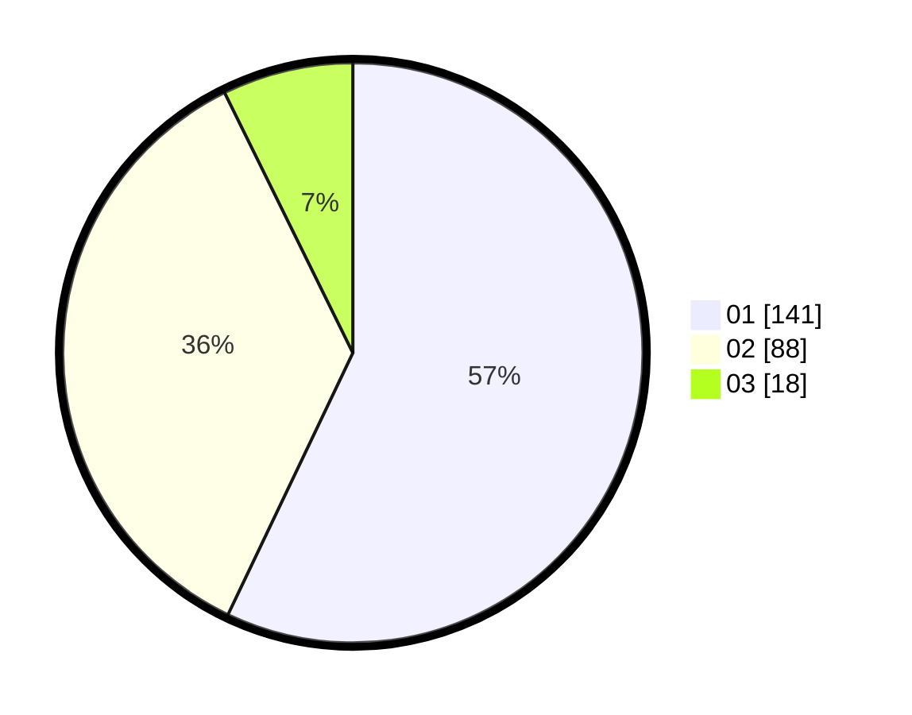

# Hasil

Hasil perolehan suara paslon dapat dilihat pada file paslon-01.txt, paslon-02.txt, dan paslon-03.txt.

Jika tidak ada, artinya data tersebut belum ada pada SIREKAP.

## Perolehan Suara

 * Paslon 01: **141**.
 * Paslon 02: **88**.
 * Paslon 03: **18**.

## Foto C Plano

https://sirekap-obj-formc.kpu.go.id/6afc/pemilu/ppwp/31/75/08/10/05/3175081005100-20240215-014630--c9ac7e23-68b3-4f02-9fbf-fcdcb4848091.jpg

https://sirekap-obj-formc.kpu.go.id/6afc/pemilu/ppwp/31/75/08/10/05/3175081005100-20240215-014702--e4fb30e0-cf15-4b8c-a9a4-d50bcf4d5f0c.jpg

https://sirekap-obj-formc.kpu.go.id/6afc/pemilu/ppwp/31/75/08/10/05/3175081005100-20240215-014731--cdf344c3-6b65-4a59-9c73-1700272cd5d4.jpg
