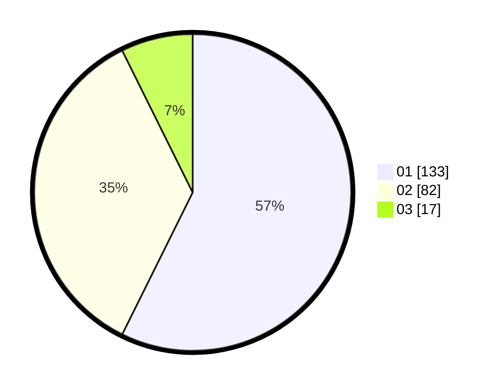

# Hasil

Hasil perolehan suara paslon dapat dilihat pada file paslon-01.txt, paslon-02.txt, dan paslon-03.txt.

Jika tidak ada, artinya data tersebut belum ada pada SIREKAP.

## Perolehan Suara

 * Paslon 01: **133**.
 * Paslon 02: **82**.
 * Paslon 03: **17**.

## Foto C Plano

https://sirekap-obj-formc.kpu.go.id/3662/pemilu/ppwp/31/75/08/10/05/3175081005101-20240214-201329--da843a77-4c37-4bf9-a5b1-e7195976db12.jpg

https://sirekap-obj-formc.kpu.go.id/3662/pemilu/ppwp/31/75/08/10/05/3175081005101-20240214-201509--f7f0d28c-df90-497e-b354-a2df8566409f.jpg

https://sirekap-obj-formc.kpu.go.id/3662/pemilu/ppwp/31/75/08/10/05/3175081005101-20240214-201549--feb0faad-beee-496f-b2e4-7a5c193c4fd5.jpg

## DATA PEMILIH TETAP

Jumlah pemilih dalam DPT: **241**.
 * L: **127**.
 * P: **114**.

## DATA PENGGUNA HAK PILIH

Jumlah pengguna hak pilih dalam DPT: **241**.
 * L: **127**.
 * P: **114**.

Jumlah pengguna hak pilih dalam DPTb: **3**.
 * L: **1**.
 * P: **2**.

Jumlah pengguna hak pilih dalam DPK: **1**.
 * L: **1**.
 * P: **0**.

Jumlah pengguna hak pilih: **245**.
 * L: **129**.
 * P: **116**.

## JUMLAH SUARA SAH DAN TIDAK SAH

JUMLAH SELURUH SUARA SAH: **232**.

JUMLAH SUARA TIDAK SAH: **13**.

JUMLAH SELURUH SUARA SAH DAN SUARA TIDAK SAH: **245**.
