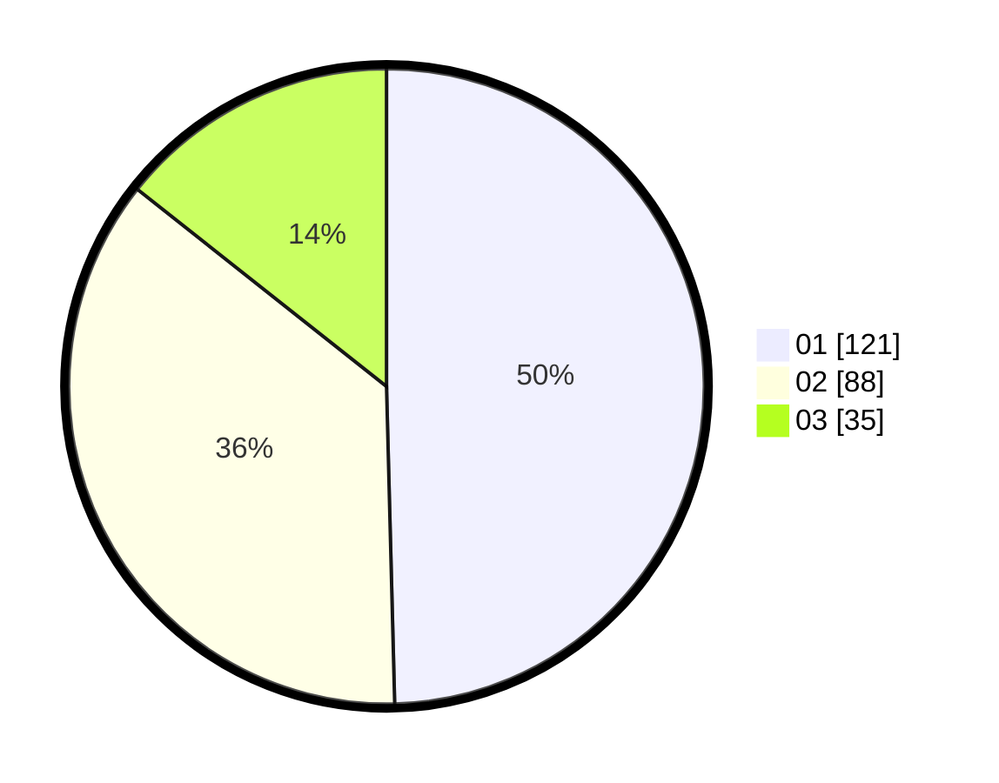

# Hasil

Hasil perolehan suara paslon dapat dilihat pada file paslon-01.txt, paslon-02.txt, dan paslon-03.txt.

Jika tidak ada, artinya data tersebut belum ada pada SIREKAP.

## Perolehan Suara

 * Paslon 01: **121**.
 * Paslon 02: **88**.
 * Paslon 03: **35**.

## Foto C Plano

https://sirekap-obj-formc.kpu.go.id/9d00/pemilu/ppwp/31/75/08/10/05/3175081005102-20240214-213223--f831b707-1b26-4947-b0c4-894c35aca445.jpg

https://sirekap-obj-formc.kpu.go.id/9d00/pemilu/ppwp/31/75/08/10/05/3175081005102-20240214-213422--768633c0-2aa0-4e29-9f2b-7db19501a56e.jpg

https://sirekap-obj-formc.kpu.go.id/9d00/pemilu/ppwp/31/75/08/10/05/3175081005102-20240214-213459--fe9d8b31-2b68-4f3b-9af0-8572d1085b32.jpg

## DATA PEMILIH TETAP

Jumlah pemilih dalam DPT: **270**.
 * L: **132**.
 * P: **138**.

## DATA PENGGUNA HAK PILIH

Jumlah pengguna hak pilih dalam DPT: **236**.
 * L: **114**.
 * P: **122**.

Jumlah pengguna hak pilih dalam DPTb: **4**.
 * L: **1**.
 * P: **3**.

Jumlah pengguna hak pilih dalam DPK: **6**.
 * L: **3**.
 * P: **3**.

Jumlah pengguna hak pilih: **246**.
 * L: **118**.
 * P: **128**.

## JUMLAH SUARA SAH DAN TIDAK SAH

JUMLAH SELURUH SUARA SAH: **244**.

JUMLAH SUARA TIDAK SAH: **2**.

JUMLAH SELURUH SUARA SAH DAN SUARA TIDAK SAH: **246**.
