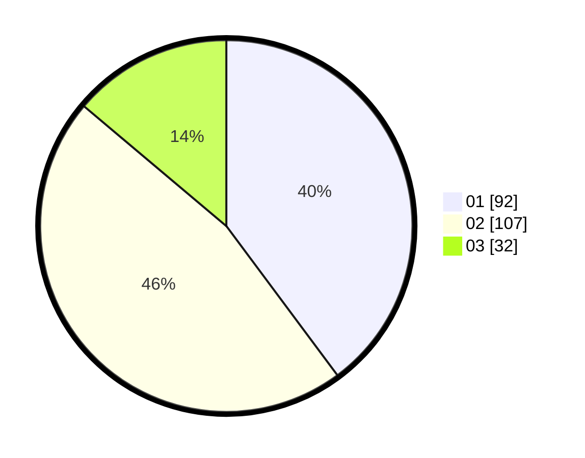

# Hasil

Hasil perolehan suara paslon dapat dilihat pada file paslon-01.txt, paslon-02.txt, dan paslon-03.txt.

Jika tidak ada, artinya data tersebut belum ada pada SIREKAP.

## Perolehan Suara

 * Paslon 01: **92**.
 * Paslon 02: **107**.
 * Paslon 03: **32**.

## Foto C Plano

https://sirekap-obj-formc.kpu.go.id/2a5c/pemilu/ppwp/31/75/08/10/05/3175081005103-20240214-185652--2a1647b3-5ce1-4d95-ab26-a1fcdeaf1b92.jpg

https://sirekap-obj-formc.kpu.go.id/2a5c/pemilu/ppwp/31/75/08/10/05/3175081005103-20240214-185751--2122feb9-1ae6-4e03-8800-7c9d3d34a8a2.jpg

https://sirekap-obj-formc.kpu.go.id/2a5c/pemilu/ppwp/31/75/08/10/05/3175081005103-20240214-191028--897a56f2-f85e-4c0a-b5ca-4e351616e82c.jpg

## DATA PEMILIH TETAP

Jumlah pemilih dalam DPT: **266**.
 * L: **133**.
 * P: **133**.

## DATA PENGGUNA HAK PILIH

Jumlah pengguna hak pilih dalam DPT: **226**.
 * L: **111**.
 * P: **115**.

Jumlah pengguna hak pilih dalam DPTb: **0**.
 * L: **0**.
 * P: **0**.

Jumlah pengguna hak pilih dalam DPK: **7**.
 * L: **3**.
 * P: **4**.

Jumlah pengguna hak pilih: **233**.
 * L: **114**.
 * P: **119**.

## JUMLAH SUARA SAH DAN TIDAK SAH

JUMLAH SELURUH SUARA SAH: **231**.

JUMLAH SUARA TIDAK SAH: **2**.

JUMLAH SELURUH SUARA SAH DAN SUARA TIDAK SAH: **233**.
