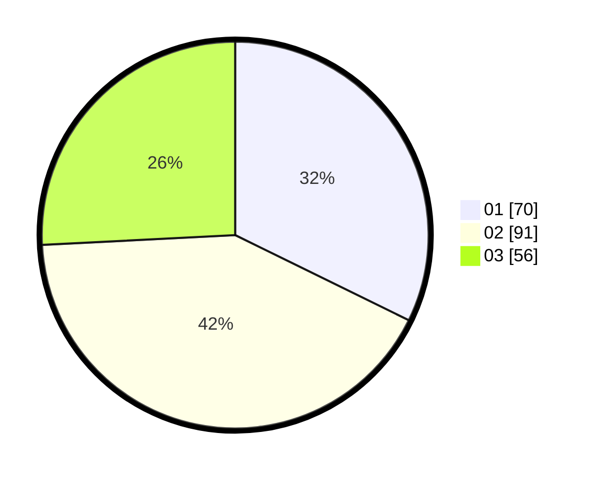

# Hasil

Hasil perolehan suara paslon dapat dilihat pada file paslon-01.txt, paslon-02.txt, dan paslon-03.txt.

Jika tidak ada, artinya data tersebut belum ada pada SIREKAP.

## Perolehan Suara

 * Paslon 01: **70**.
 * Paslon 02: **91**.
 * Paslon 03: **56**.

## Foto C Plano

https://sirekap-obj-formc.kpu.go.id/02f1/pemilu/ppwp/31/75/08/10/05/3175081005112-20240214-201423--46d883f7-d98e-4c03-af56-0475fa103c99.jpg

https://sirekap-obj-formc.kpu.go.id/02f1/pemilu/ppwp/31/75/08/10/05/3175081005112-20240214-201412--0e6e7e32-e1d6-412d-8703-af689ff11889.jpg

https://sirekap-obj-formc.kpu.go.id/02f1/pemilu/ppwp/31/75/08/10/05/3175081005112-20240214-201506--32748426-3bf0-4fbc-aed8-18dc614f7af8.jpg
