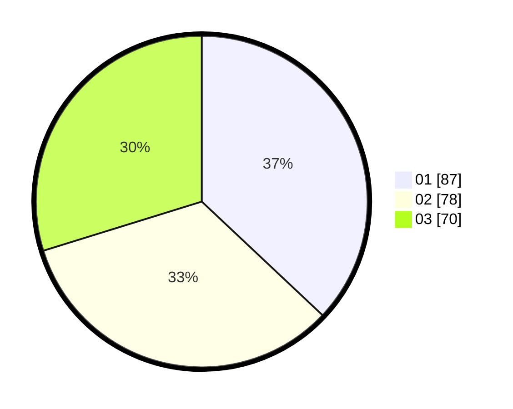

# Hasil

Hasil perolehan suara paslon dapat dilihat pada file paslon-01.txt, paslon-02.txt, dan paslon-03.txt.

Jika tidak ada, artinya data tersebut belum ada pada SIREKAP.

## Perolehan Suara

 * Paslon 01: **87**.
 * Paslon 02: **78**.
 * Paslon 03: **70**.

## Foto C Plano

https://sirekap-obj-formc.kpu.go.id/0930/pemilu/ppwp/31/75/08/10/05/3175081005113-20240215-121534--9caa6824-43ce-483f-b501-67b67664f274.jpg

https://sirekap-obj-formc.kpu.go.id/0930/pemilu/ppwp/31/75/08/10/05/3175081005113-20240215-121413--527b00ac-a42c-4183-ac61-f8d7ad6fc320.jpg

https://sirekap-obj-formc.kpu.go.id/0930/pemilu/ppwp/31/75/08/10/05/3175081005113-20240215-121809--496d0245-bee1-4098-91ac-69b883e33784.jpg
