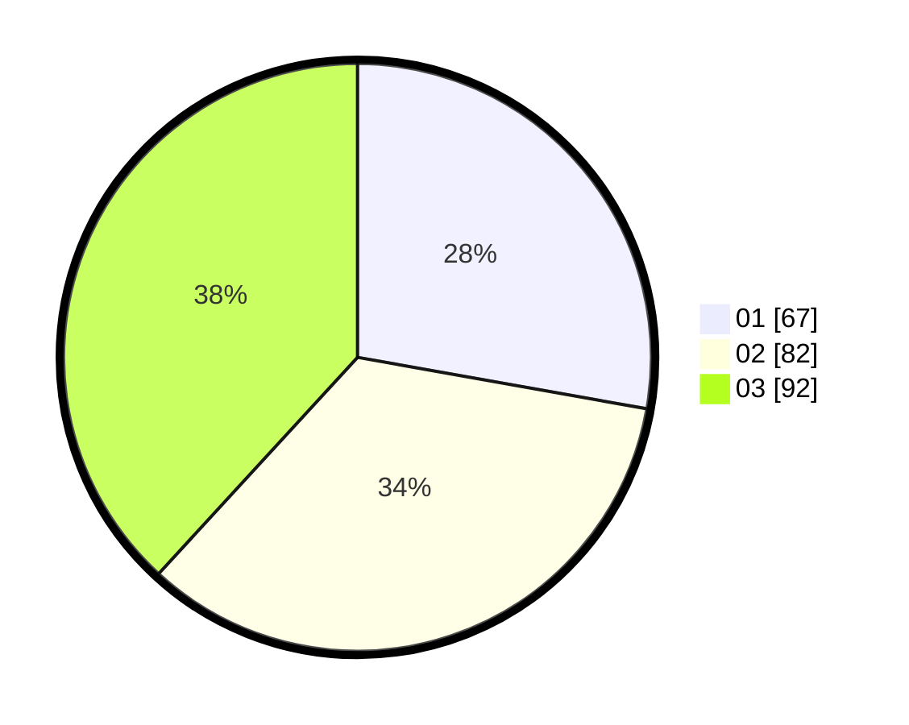

# Hasil

Hasil perolehan suara paslon dapat dilihat pada file paslon-01.txt, paslon-02.txt, dan paslon-03.txt.

Jika tidak ada, artinya data tersebut belum ada pada SIREKAP.

## Perolehan Suara

 * Paslon 01: **67**.
 * Paslon 02: **82**.
 * Paslon 03: **92**.

## Foto C Plano

https://sirekap-obj-formc.kpu.go.id/613d/pemilu/ppwp/31/75/08/10/05/3175081005117-20240214-220816--a248f8ee-392d-4f00-a928-79dddc2ad299.jpg

https://sirekap-obj-formc.kpu.go.id/613d/pemilu/ppwp/31/75/08/10/05/3175081005117-20240214-211603--70864a4f-a00c-494f-b305-0a67d85b907f.jpg

https://sirekap-obj-formc.kpu.go.id/613d/pemilu/ppwp/31/75/08/10/05/3175081005117-20240214-220936--020ac73b-d116-4fde-abfb-04350f11e893.jpg
