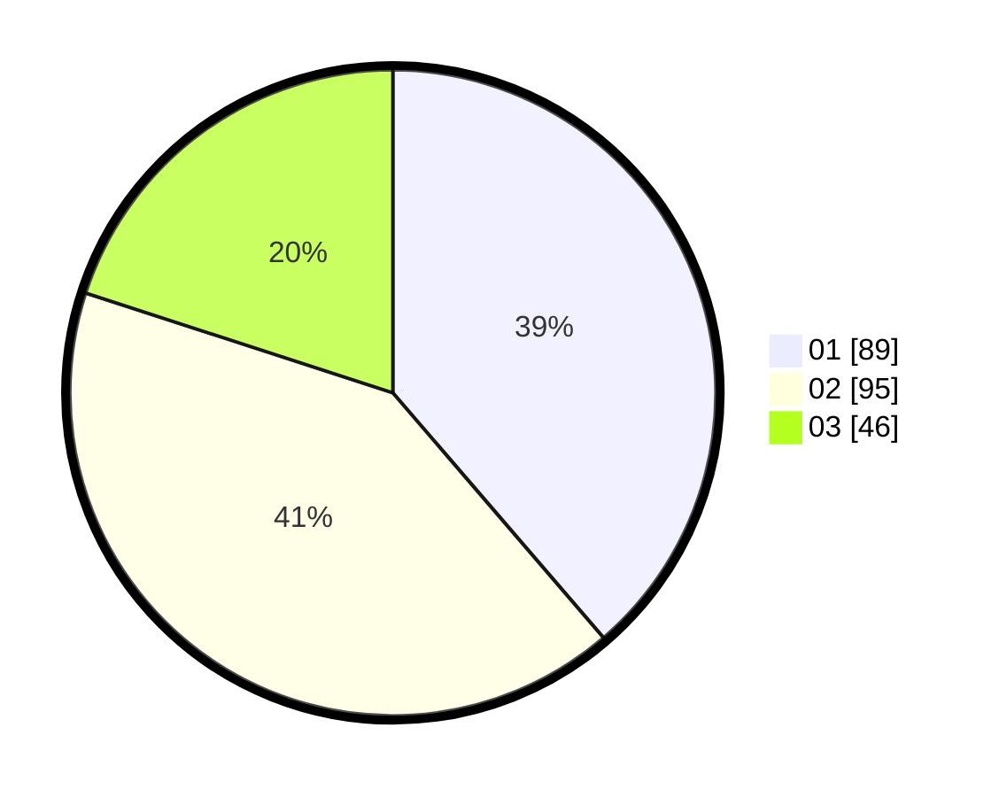

# Hasil

Hasil perolehan suara paslon dapat dilihat pada file paslon-01.txt, paslon-02.txt, dan paslon-03.txt.

Jika tidak ada, artinya data tersebut belum ada pada SIREKAP.

## Perolehan Suara

 * Paslon 01: **89**.
 * Paslon 02: **95**.
 * Paslon 03: **46**.

## Foto C Plano

https://sirekap-obj-formc.kpu.go.id/c3d3/pemilu/ppwp/31/75/08/10/05/3175081005118-20240214-222104--7a17d977-a870-493c-9cad-5240adfd54fd.jpg

https://sirekap-obj-formc.kpu.go.id/c3d3/pemilu/ppwp/31/75/08/10/05/3175081005118-20240214-222459--357d5729-4026-4cc8-ad07-87f6d55c810a.jpg

https://sirekap-obj-formc.kpu.go.id/c3d3/pemilu/ppwp/31/75/08/10/05/3175081005118-20240214-222549--82d089e7-6821-4dbe-b0de-e121120302cb.jpg
