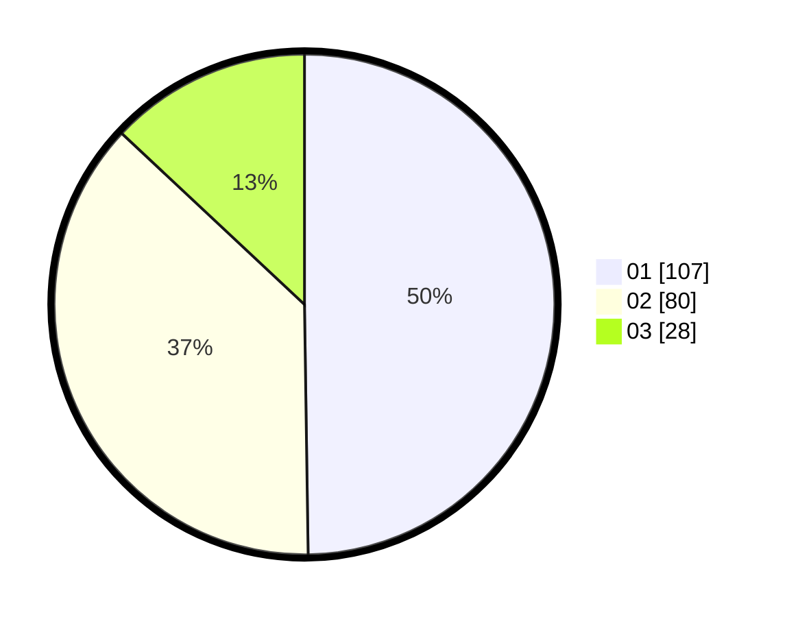

# Hasil

Hasil perolehan suara paslon dapat dilihat pada file paslon-01.txt, paslon-02.txt, dan paslon-03.txt.

Jika tidak ada, artinya data tersebut belum ada pada SIREKAP.

## Perolehan Suara

 * Paslon 01: **107**.
 * Paslon 02: **80**.
 * Paslon 03: **28**.

## Foto C Plano

https://sirekap-obj-formc.kpu.go.id/b92b/pemilu/ppwp/31/75/08/10/05/3175081005119-20240215-020129--f4ad92d2-f819-4513-8f41-48549c754b63.jpg

https://sirekap-obj-formc.kpu.go.id/b92b/pemilu/ppwp/31/75/08/10/05/3175081005119-20240215-020253--22fbb60d-1bee-4bd8-976e-b844a8b0620f.jpg

https://sirekap-obj-formc.kpu.go.id/b92b/pemilu/ppwp/31/75/08/10/05/3175081005119-20240215-020340--824e43a1-a0f0-4b3d-b8be-b07999ef654d.jpg
