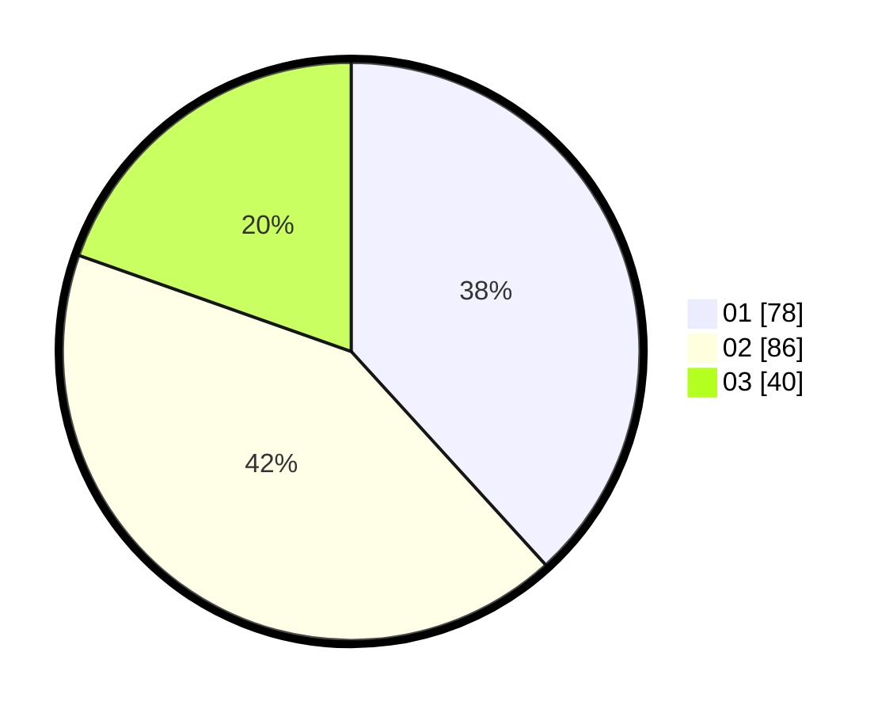

# Hasil

Hasil perolehan suara paslon dapat dilihat pada file paslon-01.txt, paslon-02.txt, dan paslon-03.txt.

Jika tidak ada, artinya data tersebut belum ada pada SIREKAP.

## Perolehan Suara

 * Paslon 01: **78**.
 * Paslon 02: **86**.
 * Paslon 03: **40**.

## Foto C Plano

https://sirekap-obj-formc.kpu.go.id/ca8c/pemilu/ppwp/31/75/08/10/05/3175081005120-20240216-014956--2cc0496a-009e-415b-9575-e0afa1a5eb20.jpg

https://sirekap-obj-formc.kpu.go.id/ca8c/pemilu/ppwp/31/75/08/10/05/3175081005120-20240216-014958--b5246df3-7819-4797-90fa-d0454c53e789.jpg

https://sirekap-obj-formc.kpu.go.id/ca8c/pemilu/ppwp/31/75/08/10/05/3175081005120-20240216-014958--87432278-fd77-4220-999a-ff78b9efaabc.jpg

## DATA PEMILIH TETAP

Jumlah pemilih dalam DPT: **258**.
 * L: **119**.
 * P: **139**.

## DATA PENGGUNA HAK PILIH

Jumlah pengguna hak pilih dalam DPT: **200**.
 * L: **84**.
 * P: **116**.

Jumlah pengguna hak pilih dalam DPTb: **0**.
 * L: **0**.
 * P: **0**.

Jumlah pengguna hak pilih dalam DPK: **3**.
 * L: **0**.
 * P: **3**.

Jumlah pengguna hak pilih: **204**.
 * L: **84**.
 * P: **120**.

## JUMLAH SUARA SAH DAN TIDAK SAH

JUMLAH SELURUH SUARA SAH: **204**.

JUMLAH SUARA TIDAK SAH: **3**.

JUMLAH SELURUH SUARA SAH DAN SUARA TIDAK SAH: **207**.
