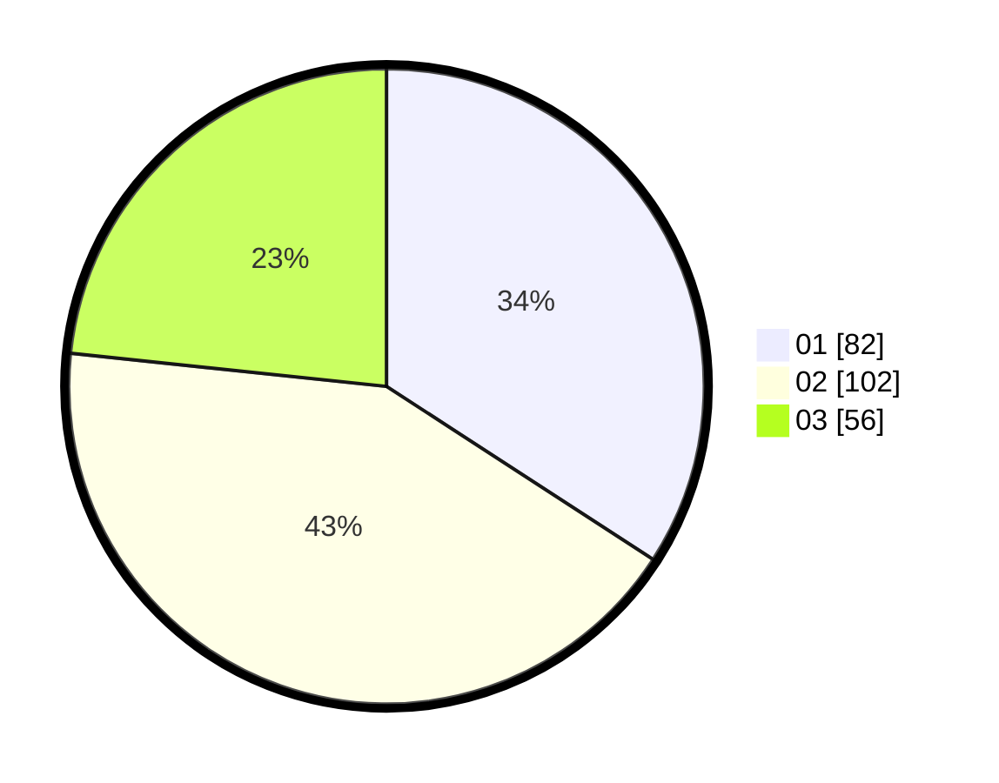

# Hasil

Hasil perolehan suara paslon dapat dilihat pada file paslon-01.txt, paslon-02.txt, dan paslon-03.txt.

Jika tidak ada, artinya data tersebut belum ada pada SIREKAP.

## Perolehan Suara

 * Paslon 01: **82**.
 * Paslon 02: **102**.
 * Paslon 03: **56**.

## Foto C Plano

https://sirekap-obj-formc.kpu.go.id/6977/pemilu/ppwp/31/75/08/10/05/3175081005124-20240214-185340--57b2d90e-d08d-47fb-aa03-b5fdc0d84967.jpg

https://sirekap-obj-formc.kpu.go.id/6977/pemilu/ppwp/31/75/08/10/05/3175081005124-20240214-185343--6d7eb29a-a864-4dae-a9f9-9af02dfe1c4f.jpg

https://sirekap-obj-formc.kpu.go.id/6977/pemilu/ppwp/31/75/08/10/05/3175081005124-20240214-185457--bc969666-53aa-4335-a47c-a1609beb8367.jpg

## DATA PEMILIH TETAP

Jumlah pemilih dalam DPT: **295**.
 * L: **139**.
 * P: **156**.

## DATA PENGGUNA HAK PILIH

Jumlah pengguna hak pilih dalam DPT: **237**.
 * L: **106**.
 * P: **131**.

Jumlah pengguna hak pilih dalam DPTb: **2**.
 * L: **2**.
 * P: **0**.

Jumlah pengguna hak pilih dalam DPK: **5**.
 * L: **2**.
 * P: **3**.

Jumlah pengguna hak pilih: **244**.
 * L: **110**.
 * P: **134**.

## JUMLAH SUARA SAH DAN TIDAK SAH

JUMLAH SELURUH SUARA SAH: **240**.

JUMLAH SUARA TIDAK SAH: **4**.

JUMLAH SELURUH SUARA SAH DAN SUARA TIDAK SAH: **244**.
