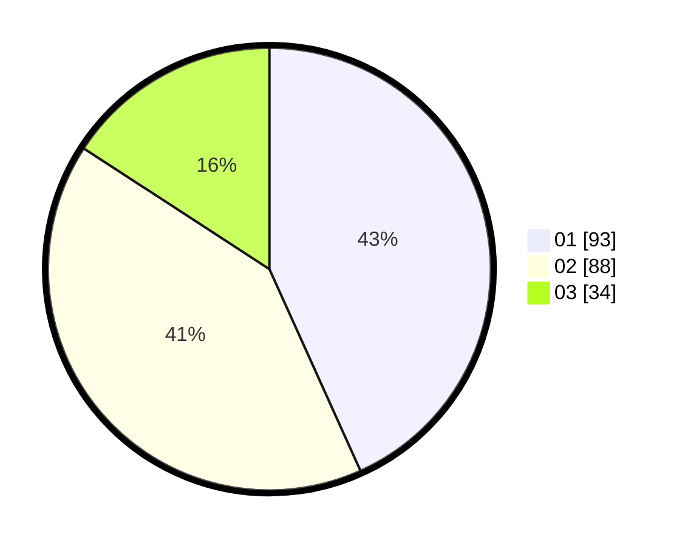

# Hasil

Hasil perolehan suara paslon dapat dilihat pada file paslon-01.txt, paslon-02.txt, dan paslon-03.txt.

Jika tidak ada, artinya data tersebut belum ada pada SIREKAP.

## Perolehan Suara

 * Paslon 01: **93**.
 * Paslon 02: **88**.
 * Paslon 03: **34**.

## Foto C Plano

https://sirekap-obj-formc.kpu.go.id/5253/pemilu/ppwp/31/75/08/10/05/3175081005126-20240216-143747--5b2150d5-81cd-463d-a15e-3b34b8fef986.jpg

https://sirekap-obj-formc.kpu.go.id/5253/pemilu/ppwp/31/75/08/10/05/3175081005126-20240216-143749--74c51c2f-8862-4a55-8220-df37676005a9.jpg

https://sirekap-obj-formc.kpu.go.id/5253/pemilu/ppwp/31/75/08/10/05/3175081005126-20240216-143748--ef6f5c08-8a4d-48a4-834b-3262b9705255.jpg

## DATA PEMILIH TETAP

Jumlah pemilih dalam DPT: **285**.
 * L: **128**.
 * P: **157**.

## DATA PENGGUNA HAK PILIH

Jumlah pengguna hak pilih dalam DPT: **216**.
 * L: **95**.
 * P: **121**.

Jumlah pengguna hak pilih dalam DPTb: **2**.
 * L: **1**.
 * P: **1**.

Jumlah pengguna hak pilih dalam DPK: **0**.
 * L: **0**.
 * P: **0**.

Jumlah pengguna hak pilih: **218**.
 * L: **96**.
 * P: **122**.

## JUMLAH SUARA SAH DAN TIDAK SAH

JUMLAH SELURUH SUARA SAH: **215**.

JUMLAH SUARA TIDAK SAH: **3**.

JUMLAH SELURUH SUARA SAH DAN SUARA TIDAK SAH: **218**.
