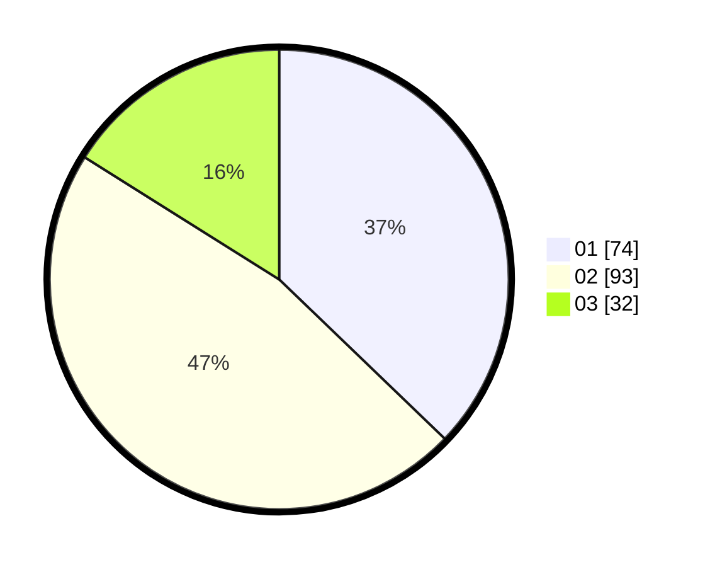

# Hasil

Hasil perolehan suara paslon dapat dilihat pada file paslon-01.txt, paslon-02.txt, dan paslon-03.txt.

Jika tidak ada, artinya data tersebut belum ada pada SIREKAP.

## Perolehan Suara

 * Paslon 01: **74**.
 * Paslon 02: **93**.
 * Paslon 03: **32**.

## Foto C Plano

https://sirekap-obj-formc.kpu.go.id/b482/pemilu/ppwp/31/75/08/10/05/3175081005128-20240214-215346--faa172e2-f0cb-4497-97c1-794fdf59b5e4.jpg

https://sirekap-obj-formc.kpu.go.id/b482/pemilu/ppwp/31/75/08/10/05/3175081005128-20240214-215513--6765d0d2-71af-4266-8c0e-7fde50e55306.jpg

https://sirekap-obj-formc.kpu.go.id/b482/pemilu/ppwp/31/75/08/10/05/3175081005128-20240214-215723--94a0253d-9876-4bb9-836f-da2e9c2ccfcf.jpg
