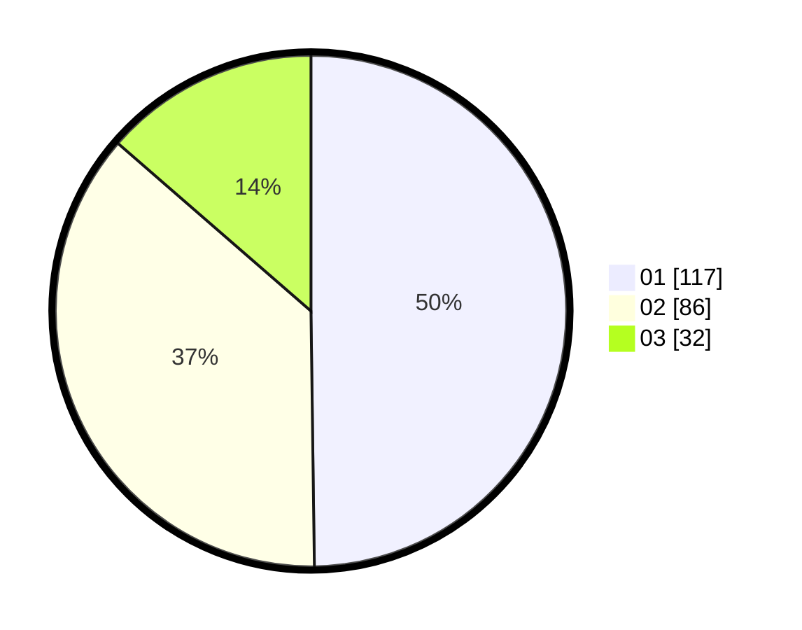

# Hasil

Hasil perolehan suara paslon dapat dilihat pada file paslon-01.txt, paslon-02.txt, dan paslon-03.txt.

Jika tidak ada, artinya data tersebut belum ada pada SIREKAP.

## Perolehan Suara

 * Paslon 01: **117**.
 * Paslon 02: **86**.
 * Paslon 03: **32**.

## Foto C Plano

https://sirekap-obj-formc.kpu.go.id/5e1a/pemilu/ppwp/31/75/08/10/05/3175081005131-20240216-090613--b75cd677-e18c-43aa-b1d0-d4ca8c6d23f3.jpg

https://sirekap-obj-formc.kpu.go.id/5e1a/pemilu/ppwp/31/75/08/10/05/3175081005131-20240216-090620--6eb1249f-b9d9-48ca-ab2e-447704cfc016.jpg

https://sirekap-obj-formc.kpu.go.id/5e1a/pemilu/ppwp/31/75/08/10/05/3175081005131-20240216-090618--e365c935-684b-404a-8720-e4a64a522376.jpg

## DATA PEMILIH TETAP

Jumlah pemilih dalam DPT: **279**.
 * L: **143**.
 * P: **136**.

## DATA PENGGUNA HAK PILIH

Jumlah pengguna hak pilih dalam DPT: **230**.
 * L: **109**.
 * P: **121**.

Jumlah pengguna hak pilih dalam DPTb: **1**.
 * L: **1**.
 * P: **0**.

Jumlah pengguna hak pilih dalam DPK: **5**.
 * L: **3**.
 * P: **2**.

Jumlah pengguna hak pilih: **236**.
 * L: **113**.
 * P: **123**.

## JUMLAH SUARA SAH DAN TIDAK SAH

JUMLAH SELURUH SUARA SAH: **235**.

JUMLAH SUARA TIDAK SAH: **1**.

JUMLAH SELURUH SUARA SAH DAN SUARA TIDAK SAH: **236**.
