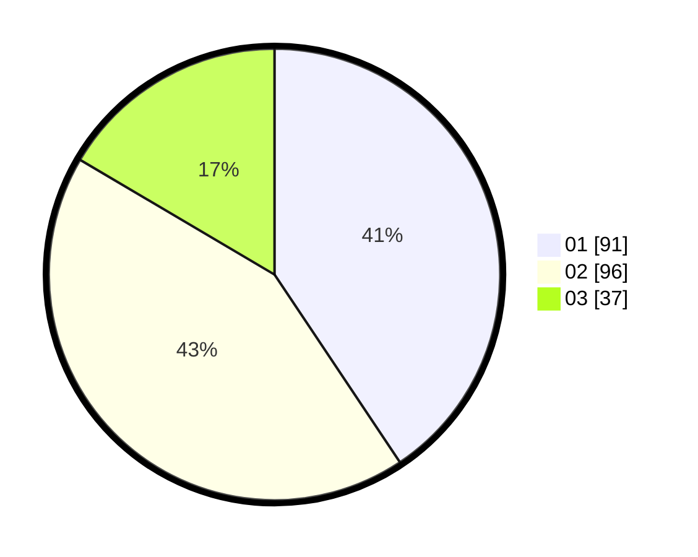

# Hasil

Hasil perolehan suara paslon dapat dilihat pada file paslon-01.txt, paslon-02.txt, dan paslon-03.txt.

Jika tidak ada, artinya data tersebut belum ada pada SIREKAP.

## Perolehan Suara

 * Paslon 01: **91**.
 * Paslon 02: **96**.
 * Paslon 03: **37**.

## Foto C Plano

https://sirekap-obj-formc.kpu.go.id/cd12/pemilu/ppwp/31/75/08/10/05/3175081005136-20240216-150542--4461d9e9-6612-43f3-b5cf-a33a075c0316.jpg

https://sirekap-obj-formc.kpu.go.id/cd12/pemilu/ppwp/31/75/08/10/05/3175081005136-20240216-150544--99daf7d1-c6f1-4979-aa28-f218fb5cc8b1.jpg

https://sirekap-obj-formc.kpu.go.id/cd12/pemilu/ppwp/31/75/08/10/05/3175081005136-20240216-150543--00ffb84f-931b-492b-b6e5-b2abb8093d61.jpg

## DATA PEMILIH TETAP

Jumlah pemilih dalam DPT: **274**.
 * L: **136**.
 * P: **138**.

## DATA PENGGUNA HAK PILIH

Jumlah pengguna hak pilih dalam DPT: **227**.
 * L: **114**.
 * P: **113**.

Jumlah pengguna hak pilih dalam DPTb: **0**.
 * L: **0**.
 * P: **0**.

Jumlah pengguna hak pilih dalam DPK: **4**.
 * L: **2**.
 * P: **2**.

Jumlah pengguna hak pilih: **231**.
 * L: **116**.
 * P: **115**.

## JUMLAH SUARA SAH DAN TIDAK SAH

JUMLAH SELURUH SUARA SAH: **224**.

JUMLAH SUARA TIDAK SAH: **7**.

JUMLAH SELURUH SUARA SAH DAN SUARA TIDAK SAH: **231**.
