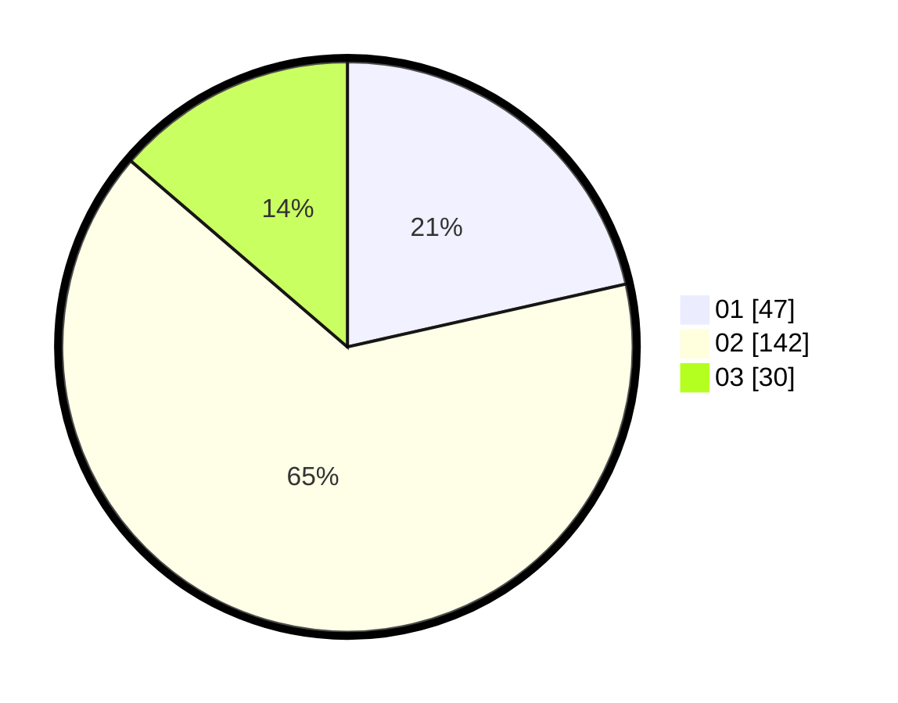

# Hasil

Hasil perolehan suara paslon dapat dilihat pada file paslon-01.txt, paslon-02.txt, dan paslon-03.txt.

Jika tidak ada, artinya data tersebut belum ada pada SIREKAP.

## Perolehan Suara

 * Paslon 01: **47**.
 * Paslon 02: **142**.
 * Paslon 03: **30**.

## Foto C Plano

https://sirekap-obj-formc.kpu.go.id/c2a1/pemilu/ppwp/31/75/09/10/01/3175091001001-20240214-191440--70ded8b8-659a-4777-b84e-12bdd58b3551.jpg

https://sirekap-obj-formc.kpu.go.id/c2a1/pemilu/ppwp/31/75/09/10/01/3175091001001-20240214-155634--515b9a5d-f0bd-47ef-a59a-f8b54da94f40.jpg

https://sirekap-obj-formc.kpu.go.id/c2a1/pemilu/ppwp/31/75/09/10/01/3175091001001-20240214-191642--6a5d3cda-8779-4ea4-831d-ffb12618a779.jpg

## DATA PEMILIH TETAP

Jumlah pemilih dalam DPT: **262**.
 * L: **131**.
 * P: **131**.

## DATA PENGGUNA HAK PILIH

Jumlah pengguna hak pilih dalam DPT: **221**.
 * L: **107**.
 * P: **114**.

Jumlah pengguna hak pilih dalam DPTb: **1**.
 * L: **1**.
 * P: **0**.

Jumlah pengguna hak pilih dalam DPK: **2**.
 * L: **1**.
 * P: **1**.

Jumlah pengguna hak pilih: **224**.
 * L: **109**.
 * P: **115**.

## JUMLAH SUARA SAH DAN TIDAK SAH

JUMLAH SELURUH SUARA SAH: **219**.

JUMLAH SUARA TIDAK SAH: **5**.

JUMLAH SELURUH SUARA SAH DAN SUARA TIDAK SAH: **224**.
