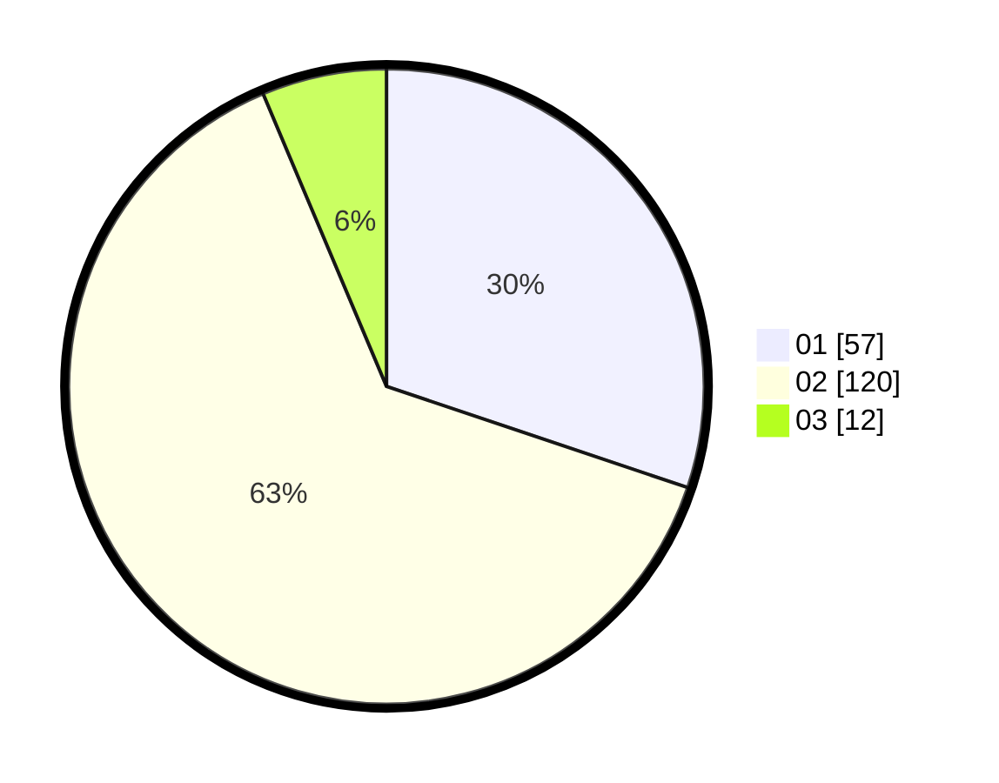

# Hasil

Hasil perolehan suara paslon dapat dilihat pada file paslon-01.txt, paslon-02.txt, dan paslon-03.txt.

Jika tidak ada, artinya data tersebut belum ada pada SIREKAP.

## Perolehan Suara

 * Paslon 01: **57**.
 * Paslon 02: **120**.
 * Paslon 03: **12**.

## Foto C Plano

https://sirekap-obj-formc.kpu.go.id/e381/pemilu/ppwp/31/75/09/10/01/3175091001003-20240216-234339--c17bc96d-b004-4172-a9e2-08f51c1c09e0.jpg

https://sirekap-obj-formc.kpu.go.id/e381/pemilu/ppwp/31/75/09/10/01/3175091001003-20240216-234520--76438d89-6ebd-41b6-9b47-5e33461ab37d.jpg

https://sirekap-obj-formc.kpu.go.id/e381/pemilu/ppwp/31/75/09/10/01/3175091001003-20240216-235447--e4132bb9-22b1-41bc-9563-f90fa3baf93b.jpg

## DATA PEMILIH TETAP

Jumlah pemilih dalam DPT: **261**.
 * L: **126**.
 * P: **135**.

## DATA PENGGUNA HAK PILIH

Jumlah pengguna hak pilih dalam DPT: **189**.
 * L: **92**.
 * P: **97**.

Jumlah pengguna hak pilih dalam DPTb: **0**.
 * L: **0**.
 * P: **0**.

Jumlah pengguna hak pilih dalam DPK: **2**.
 * L: **1**.
 * P: **1**.

Jumlah pengguna hak pilih: **191**.
 * L: **93**.
 * P: **98**.

## JUMLAH SUARA SAH DAN TIDAK SAH

JUMLAH SELURUH SUARA SAH: **189**.

JUMLAH SUARA TIDAK SAH: **2**.

JUMLAH SELURUH SUARA SAH DAN SUARA TIDAK SAH: **191**.
