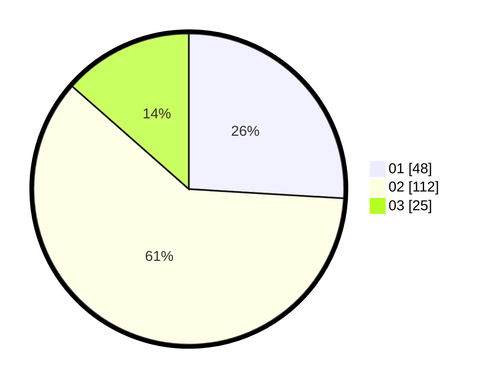

# Hasil

Hasil perolehan suara paslon dapat dilihat pada file paslon-01.txt, paslon-02.txt, dan paslon-03.txt.

Jika tidak ada, artinya data tersebut belum ada pada SIREKAP.

## Perolehan Suara

 * Paslon 01: **48**.
 * Paslon 02: **112**.
 * Paslon 03: **25**.

## Foto C Plano

https://sirekap-obj-formc.kpu.go.id/5550/pemilu/ppwp/31/75/09/10/01/3175091001005-20240214-202052--97c46354-3c9a-4054-bbe1-c904d2a84ce9.jpg

https://sirekap-obj-formc.kpu.go.id/5550/pemilu/ppwp/31/75/09/10/01/3175091001005-20240214-202123--79b98e6c-b1cd-4024-962d-6b342a67268f.jpg

https://sirekap-obj-formc.kpu.go.id/5550/pemilu/ppwp/31/75/09/10/01/3175091001005-20240214-202222--a22b0ddf-f457-4b4a-a752-1bb03f7bd62f.jpg

## DATA PEMILIH TETAP

Jumlah pemilih dalam DPT: **261**.
 * L: **423**.
 * P: **134**.

## DATA PENGGUNA HAK PILIH

Jumlah pengguna hak pilih dalam DPT: **186**.
 * L: **83**.
 * P: **103**.

Jumlah pengguna hak pilih dalam DPTb: **0**.
 * L: **0**.
 * P: **0**.

Jumlah pengguna hak pilih dalam DPK: **1**.
 * L: **1**.
 * P: **0**.

Jumlah pengguna hak pilih: **187**.
 * L: **84**.
 * P: **103**.

## JUMLAH SUARA SAH DAN TIDAK SAH

JUMLAH SELURUH SUARA SAH: **185**.

JUMLAH SUARA TIDAK SAH: **2**.

JUMLAH SELURUH SUARA SAH DAN SUARA TIDAK SAH: **187**.
