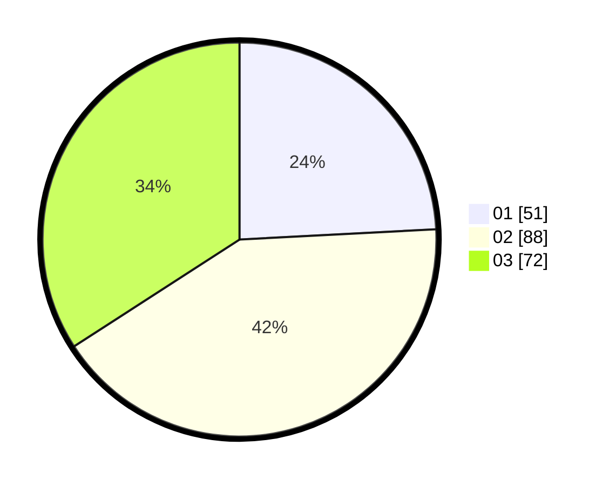

# Hasil

Hasil perolehan suara paslon dapat dilihat pada file paslon-01.txt, paslon-02.txt, dan paslon-03.txt.

Jika tidak ada, artinya data tersebut belum ada pada SIREKAP.

## Perolehan Suara

 * Paslon 01: **51**.
 * Paslon 02: **88**.
 * Paslon 03: **72**.

## Foto C Plano

https://sirekap-obj-formc.kpu.go.id/712f/pemilu/ppwp/31/75/09/10/01/3175091001006-20240218-212739--fbaa132f-113c-4f50-9dea-57cfebd5f868.jpg

https://sirekap-obj-formc.kpu.go.id/712f/pemilu/ppwp/31/75/09/10/01/3175091001006-20240218-212740--652ed30e-d219-4e12-940a-43ef1808ab4a.jpg

https://sirekap-obj-formc.kpu.go.id/712f/pemilu/ppwp/31/75/09/10/01/3175091001006-20240218-212739--bce013c2-f541-447b-8def-8fdc9a2780b8.jpg

## DATA PEMILIH TETAP

Jumlah pemilih dalam DPT: **214**.
 * L: **99**.
 * P: **115**.

## DATA PENGGUNA HAK PILIH

Jumlah pengguna hak pilih dalam DPT: **210**.
 * L: **95**.
 * P: **115**.

Jumlah pengguna hak pilih dalam DPTb: **1**.
 * L: **1**.
 * P: **0**.

Jumlah pengguna hak pilih dalam DPK: **3**.
 * L: **3**.
 * P: **0**.

Jumlah pengguna hak pilih: **214**.
 * L: **99**.
 * P: **115**.

## JUMLAH SUARA SAH DAN TIDAK SAH

JUMLAH SELURUH SUARA SAH: **211**.

JUMLAH SUARA TIDAK SAH: **3**.

JUMLAH SELURUH SUARA SAH DAN SUARA TIDAK SAH: **214**.
