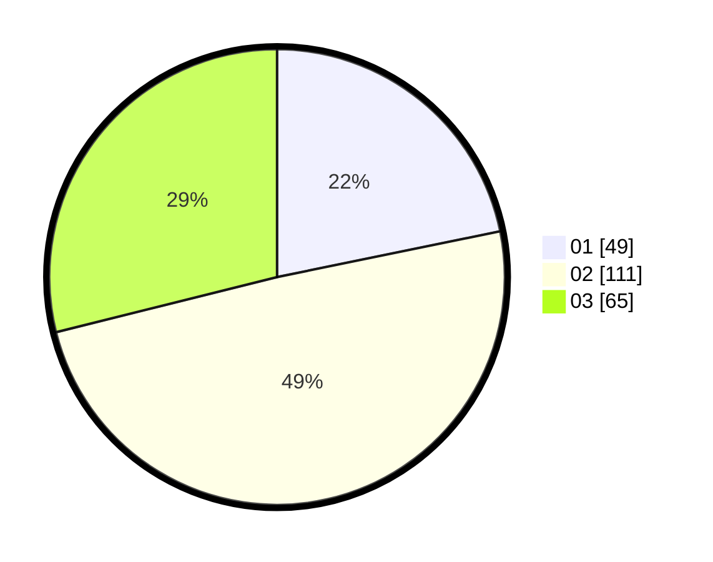

# Hasil

Hasil perolehan suara paslon dapat dilihat pada file paslon-01.txt, paslon-02.txt, dan paslon-03.txt.

Jika tidak ada, artinya data tersebut belum ada pada SIREKAP.

## Perolehan Suara

 * Paslon 01: **49**.
 * Paslon 02: **111**.
 * Paslon 03: **65**.

## Foto C Plano

https://sirekap-obj-formc.kpu.go.id/6584/pemilu/ppwp/31/75/09/10/01/3175091001007-20240214-204013--0c66fe94-f9a1-4638-a06e-1c59118f41ae.jpg

https://sirekap-obj-formc.kpu.go.id/6584/pemilu/ppwp/31/75/09/10/01/3175091001007-20240214-204206--2debaaba-0681-4bc7-94f5-39999cf72bbe.jpg

https://sirekap-obj-formc.kpu.go.id/6584/pemilu/ppwp/31/75/09/10/01/3175091001007-20240214-204427--d8a00483-252c-40b3-912d-6b1ca979790a.jpg

## DATA PEMILIH TETAP

Jumlah pemilih dalam DPT: **292**.
 * L: **139**.
 * P: **153**.

## DATA PENGGUNA HAK PILIH

Jumlah pengguna hak pilih dalam DPT: **229**.
 * L: **103**.
 * P: **126**.

Jumlah pengguna hak pilih dalam DPTb: **0**.
 * L: **0**.
 * P: **0**.

Jumlah pengguna hak pilih dalam DPK: **0**.
 * L: **0**.
 * P: **0**.

Jumlah pengguna hak pilih: **229**.
 * L: **103**.
 * P: **126**.

## JUMLAH SUARA SAH DAN TIDAK SAH

JUMLAH SELURUH SUARA SAH: **225**.

JUMLAH SUARA TIDAK SAH: **4**.

JUMLAH SELURUH SUARA SAH DAN SUARA TIDAK SAH: **229**.
